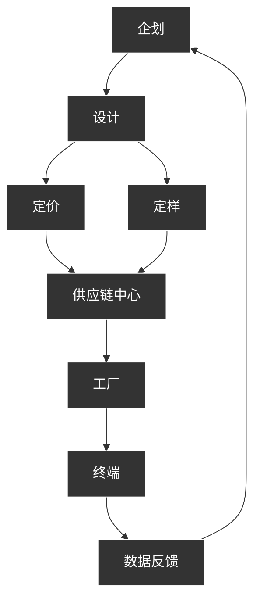

# 福建七匹狼实业股份有限公司

# FUJIAN SEPTWOLVES INDUSTRY CO.,LTD.

2024 年年度报告

SEPTWOLVES

二零二五年四月

# 第一节 重要提示、目录和释义

公司董事会、监事会及董事、监事、高级管理人员保证年度报告内容的真实、准确、完整，不存在虚假记载、误导性陈述或重大遗漏，并承担个别和连带的法律责任。

公司负责人周少雄、主管会计工作负责人范启云及会计机构负责人（会计主管人员）邓添招声明：保证本年度报告中财务报告的真实、准确、完整。

所有董事均已出席了审议本报告的董事会会议。

公司已在本报告中详细描述未来将面临的主要风险及应对措施，详情请查阅本报告“第三节 管理层讨论与分析之十一、公司未来发展的展望”部分，请投资者注意投资风险。

公司经本次董事会审议通过的利润分配预案为：以未来实施分配方案时股权登记日的总股本扣除公司回购专户上已回购股份后的总股本为基数，向全体股东每10 股派发现金红利 1 元（含税），送红股 0 股（含税），不以公积金转增股本。

# 目录

第一节 重要提示、目录和释义 ....

第二节 公司简介和主要财务指标 .... 6

第三节 管理层讨论与分析 ..... 10

第四节 公司治理 .... 36

第五节 环境和社会责任 .... 54

第六节 重要事项 ... 56

第七节 股份变动及股东情况 ... 68

第八节 优先股相关情况 .... 74

第九节 债券相关情况 ... 74

第十节 财务报告 ... 75

# 备查文件目录

一、载有公司总经理周少雄先生、主管会计工作的负责人范启云先生、会计机构负责人邓添招女士签名并盖章的会计报表；  
二、报告期内在中国证监会指定报纸上公开披露过的所有公司文件的正本及公告的原稿；  
三、载有法定代表人签名的 2024年年度报告原件。

释义

<table><tr><td>释义项</td><td>指</td><td>释义内容</td></tr><tr><td>公司</td><td>指</td><td>福建七匹狼实业股份有限公司</td></tr><tr><td>公司章程</td><td>指</td><td>《福建七匹狼实业股份有限公司章程》</td></tr><tr><td>《公司法》</td><td>指</td><td>《中华人民共和国公司法》</td></tr><tr><td>《证券法》</td><td>指</td><td>《中华人民共和国证券法》</td></tr><tr><td>加盟商</td><td>指</td><td>包括代理商和经销商。代理商指经过公司评估及授权,在某区域范围内经营七匹狼批发或零售业务的机构或个人,代理商可在公司授权的销售区域自行开设加盟店(厅、柜),或发展经销商开设加盟店(厅、柜),销售向公司购买的产品;经销商指向代理商购买公司产品,在指定区域内以经营加盟店(厅、柜)的方式销售公司产品的商户。经公司另行授权,加盟商可以开设线上专卖店,公司也可以自行发展线上加盟商。</td></tr><tr><td>直营店/加盟店</td><td>指</td><td>公司按照对零售终端的控制方式将其分为直营店和加盟店。直营店是由公司控制和直接经营,或由公司与他人共同联营的专门销售公司产品的零售终端;加盟店是由代理商、经销商控制和直接经营的专门销售公司产品的零售终端。</td></tr><tr><td>华南区</td><td>指</td><td>广东、广西、江西、海南</td></tr><tr><td>华东区</td><td>指</td><td>上海、江苏、浙江、安徽、福建、山东</td></tr><tr><td>华北区</td><td>指</td><td>北京、山西、河北、内蒙、天津</td></tr><tr><td>东北区</td><td>指</td><td>辽宁、黑龙江、吉林</td></tr><tr><td>华中区</td><td>指</td><td>河南、湖北、湖南</td></tr><tr><td>西南区</td><td>指</td><td>重庆、贵州、云南、四川、西藏</td></tr><tr><td>西北区</td><td>指</td><td>陕西、新疆、甘肃、宁夏、青海</td></tr><tr><td>元</td><td>指</td><td>人民币元</td></tr></table>

# 第二节 公司简介和主要财务指标

# 一、公司信息

<table><tr><td>股票简称</td><td>七匹狼</td><td>股票代码</td><td>002029</td></tr><tr><td>股票上市证券交易所</td><td colspan="3">深圳证券交易所</td></tr><tr><td>公司的中文名称</td><td colspan="3">福建七匹狼实业股份有限公司</td></tr><tr><td>公司的中文简称</td><td colspan="3">七匹狼</td></tr><tr><td>公司的外文名称(如有)</td><td colspan="3">FUJIAN SEPTWOLVES INDUSTRY CO., LTD.</td></tr><tr><td>公司的外文名称缩写(如有)</td><td colspan="3">SEPTWOLVES</td></tr><tr><td>公司的法定代表人</td><td colspan="3">周少雄</td></tr><tr><td>注册地址</td><td colspan="3">福建省晋江市金井镇南工业区</td></tr><tr><td>注册地址的邮政编码</td><td colspan="3">362251</td></tr><tr><td>公司注册地址历史变更情况</td><td colspan="3">无</td></tr><tr><td>办公地址</td><td colspan="3">福建省晋江市金井镇南工业区</td></tr><tr><td>办公地址的邮政编码</td><td colspan="3">362251</td></tr><tr><td>公司网址</td><td colspan="3">http://www.septwolves-group.com</td></tr><tr><td>电子信箱</td><td colspan="3">zqb@septwolves.com</td></tr></table>

# 二、联系人和联系方式

<table><tr><td></td><td>董事会秘书</td><td>证券事务代表</td></tr><tr><td>姓名</td><td>陈平</td><td>袁伟艳</td></tr><tr><td>联系地址</td><td>福建省晋江市金井镇南工业区</td><td>福建省晋江市金井镇南工业区</td></tr><tr><td>电话</td><td>0595-85337739</td><td>0595-85337739</td></tr><tr><td>传真</td><td>0595-85337766</td><td>0595-85337766</td></tr><tr><td>电子信箱</td><td>zqb@septwolves.com</td><td>zqb@septwolves.com</td></tr></table>

# 三、信息披露及备置地点

<table><tr><td>公司披露年度报告的证券交易所网站</td><td>http://www.szse.cn/</td></tr><tr><td>公司披露年度报告的媒体名称及网址</td><td>《证券时报》、《中国证券报》、《证券日报》、《上海证券报》、http://www.cninfo.com.cn</td></tr><tr><td>公司年度报告备置地点</td><td>福建省晋江市金井镇南工业区公司证券部</td></tr></table>

# 四、注册变更情况

<table><tr><td>统一社会信用代码</td><td>91350000611520128M</td></tr><tr><td>公司上市以来主营业务的变化情况(如有)</td><td>2015年,因公司发展需要,经公司第五届董事会第二十一次会议、2015年第三次临时股东大会审议通过,工商部门核准,公司在原经营范围&quot;服装服饰产品及服装原辅材料的研发设计、制造及销售,机绣制品、印花的加工,物业管理,房屋租赁,销售培训、销售咨询,室内装潢,建筑材料、五金交电、百货销售,计算机软硬件服务,对外贸易。(以上经营范围涉及许可经营项目的,应在取得有关部门的许可后方可经营)&quot;的基础上增加了&quot;对制造业、批发和零售业的投资&quot;。2022年,因业务需要,经第七届董事会第十六次会议及2021年年度股东大会审议通过,工商部门核准,公司在原经营范围上增加“特种劳动防护用品生产;特种劳动防护用品销售;劳动保护用品生产;日用口罩(非医用)销售;医护人员防护用品批发;医护人员防护用品零售;医护人员防护用品生产(I类医疗器械)”等业务范围。上述变更情况请参阅公司披露的《关于增加经营范围暨修改&lt;公司章程&gt;的公告》(编号2015-049)、《关于变更公司经营范围并修订《公司章程》及其附件的公告》(2022-013)。</td></tr><tr><td>历次控股股东的变更情况(如有)</td><td>无变更</td></tr></table>

# 五、其他有关资料

公司聘请的会计师事务所

<table><tr><td>会计师事务所名称</td><td>华兴会计师事务所（特殊普通合伙）</td></tr><tr><td>会计师事务所办公地址</td><td>福州市湖东路152号中山大厦B座6-9层</td></tr><tr><td>签字会计师姓名</td><td>林希敏 孙露</td></tr></table>

公司聘请的报告期内履行持续督导职责的保荐机构

□适用不适用

公司聘请的报告期内履行持续督导职责的财务顾问

□适用不适用

# 六、主要会计数据和财务指标

公司是否需追溯调整或重述以前年度会计数据

□是 否

<table><tr><td></td><td>2024 年</td><td>2023 年</td><td>本年比上年增减</td><td>2022 年</td></tr><tr><td>营业收入(元)</td><td>3,140,081,720.82</td><td>3,444,735,095.51</td><td>-8.84%</td><td>3,228,405,923.89</td></tr><tr><td>归属于上市公司股东的净利润(元)</td><td>284,548,796.80</td><td>270,111,122.67</td><td>5.35%</td><td>150,645,121.41</td></tr><tr><td>归属于上市公司股东的扣除非经常性损益的净利润(元)</td><td>73,469,582.94</td><td>187,719,528.68</td><td>-60.86%</td><td>105,497,782.07</td></tr><tr><td>经营活动产生的现金流量净额(元)</td><td>245,619,722.07</td><td>385,055,343.59</td><td>-36.21%</td><td>241,689,080.77</td></tr><tr><td>基本每股收益(元/股)</td><td>0.41</td><td>0.38</td><td>7.89%</td><td>0.21</td></tr><tr><td>稀释每股收益(元/股)</td><td>0.41</td><td>0.38</td><td>7.89%</td><td>0.21</td></tr><tr><td>加权平均净资产收益率</td><td>4.38%</td><td>4.28%</td><td>0.10%</td><td>2.60%</td></tr><tr><td></td><td>2024年末</td><td>2023年末</td><td>本年末比上年末增减</td><td>2022年末</td></tr><tr><td>总资产(元)</td><td>10,805,526,644.90</td><td>10,876,273,248.06</td><td>-0.65%</td><td>11,051,767,966.61</td></tr><tr><td>归属于上市公司股东的净资产(元)</td><td>6,571,306,805.58</td><td>6,428,582,152.05</td><td>2.22%</td><td>6,178,835,075.20</td></tr></table>

公司最近三个会计年度扣除非经常性损益前后净利润孰低者均为负值，且最近一年审计报告显示公司持续经营能力存在不确定性

□是 否

扣除非经常损益前后的净利润孰低者为负值

□是 否

# 七、境内外会计准则下会计数据差异

# 1、同时按照国际会计准则与按照中国会计准则披露的财务报告中净利润和净资产差异情况

□适用不适用

公司报告期不存在按照国际会计准则与按照中国会计准则披露的财务报告中净利润和净资产差异情况。

# 2、同时按照境外会计准则与按照中国会计准则披露的财务报告中净利润和净资产差异情况

□适用不适用

公司报告期不存在按照境外会计准则与按照中国会计准则披露的财务报告中净利润和净资产差异情况。

# 八、分季度主要财务指标

单位：元

<table><tr><td></td><td>第一季度</td><td>第二季度</td><td>第三季度</td><td>第四季度</td></tr><tr><td>营业收入</td><td>892,903,323.32</td><td>568,229,063.15</td><td>732,668,859.28</td><td>946,280,475.07</td></tr><tr><td>归属于上市公司股东的净利润</td><td>106,309,535.11</td><td>80,117,296.39</td><td>49,184,420.07</td><td>48,937,545.23</td></tr><tr><td>归属于上市公司股东的扣除非经常性损益的净利润</td><td>60,715,455.54</td><td>14,584,431.85</td><td>-54,939,676.31</td><td>53,109,371.86</td></tr><tr><td>经营活动产生的现金流量净额</td><td>136,209,964.27</td><td>-120,647,488.50</td><td>-114,712,782.87</td><td>344,770,029.17</td></tr></table>

上述财务指标或其加总数是否与公司已披露季度报告、半年度报告相关财务指标存在重大差异

□是 否

# 九、非经常性损益项目及金额

适用□不适用

单位：元

<table><tr><td>项目</td><td>2024年金额</td><td>2023年金额</td><td>2022年金额</td><td>说明</td></tr><tr><td>非流动性资产处置损益(包括已计提资产减值准备的冲销部分)</td><td>1,947,937.27</td><td>7,839,691.65</td><td>48,896.60</td><td></td></tr><tr><td>计入当期损益的政府补助(与公司正常经营业务密切相关,符合国家政策规定、按照确定的标准享有、对公司损益产生持续影响的政府补助除外)</td><td>23,902,060.22</td><td>54,462,291.37</td><td>54,818,338.21</td><td>本期确认收益的政府补助金</td></tr><tr><td>除同公司正常经营业务相关的有效套期保值业务外,非金融企业持有金融资产和金融负债产生的公允价值变动损益以及处置金融资产和金融负债产生的损益</td><td>236,406,195.27</td><td>36,460,873.06</td><td>8,029,736.15</td><td>主要为理财产品、股票的公允价值变动损益及实现的投资收益</td></tr><tr><td>计入当期损益的对非金融企业收取的资金占用费</td><td>0.00</td><td></td><td></td><td></td></tr><tr><td>委托他人投资或管理资产的损益</td><td>0.00</td><td></td><td></td><td></td></tr><tr><td>对外委托贷款取得的损益</td><td>0.00</td><td></td><td></td><td></td></tr><tr><td>因不可抗力因素,如遭受自然灾害而产生的各项资产损失</td><td>0.00</td><td></td><td></td><td></td></tr><tr><td>单独进行减值测试的应收款项减值准备转回</td><td>2,432,544.15</td><td>2,677,672.04</td><td>18,099.69</td><td></td></tr><tr><td>企业取得子公司、联营企业及合营企业的投资成本小于取得投资时应享有被投资单位可辨认净资产公允价值产生的收益</td><td>0.00</td><td></td><td></td><td></td></tr><tr><td>同一控制下企业合并产生的子公司期初至合并日的当期净损益</td><td>0.00</td><td></td><td></td><td></td></tr><tr><td>非货币性资产交换损益</td><td>0.00</td><td></td><td></td><td></td></tr><tr><td>债务重组损益</td><td>0.00</td><td>0.00</td><td>66,695.82</td><td></td></tr><tr><td>企业因相关经营活动不再持续而发生的一次性费用,如安置职工的支出等</td><td>0.00</td><td></td><td></td><td></td></tr><tr><td>因税收、会计等法律、法规的调整对当期损益产生的一次性影响</td><td>0.00</td><td></td><td></td><td></td></tr><tr><td>因取消、修改股权激励计划一次性确认的股份支付费用</td><td>0.00</td><td></td><td></td><td></td></tr><tr><td>对于现金结算的股份支付,在可行权日之后,应付职工薪酬的公允价值变动产生的损益</td><td>0.00</td><td></td><td></td><td></td></tr><tr><td>采用公允价值模式进行后续计量的投资性房地产公允价值变动产生的损益</td><td>0.00</td><td></td><td></td><td></td></tr><tr><td>交易价格显失公允的交易产生的收益</td><td>0.00</td><td></td><td></td><td></td></tr><tr><td>与公司正常经营业务无关的或有事项产生的损益</td><td>0.00</td><td></td><td></td><td></td></tr><tr><td>受托经营取得的托管费收入</td><td>0.00</td><td></td><td></td><td></td></tr><tr><td>除上述各项之外的其他营业外收入和支出</td><td>3,846,204.40</td><td>11,751,340.07</td><td>1,871,221.59</td><td></td></tr><tr><td>其他符合非经常性损益定义的损益项目</td><td>164,773.94</td><td>160,009.31</td><td>291,267.29</td><td></td></tr><tr><td>减:所得税影响额</td><td>38,709,209.39</td><td>24,964,316.94</td><td>17,667,379.37</td><td></td></tr><tr><td>少数股东权益影响额(税后)</td><td>18,911,292.00</td><td>5,995,966.57</td><td>2,329,536.64</td><td></td></tr><tr><td>合计</td><td>211,079,213.86</td><td>82,391,593.99</td><td>45,147,339.34</td><td>--</td></tr></table>

其他符合非经常性损益定义的损益项目的具体情况：

□适用不适用

公司不存在其他符合非经常性损益定义的损益项目的具体情况。

将《公开发行证券的公司信息披露解释性公告第 1号——非经常性损益》中列举的非经常性损益项目界定为经常性损益项目的情况说明

□适用不适用

公司不存在将《公开发行证券的公司信息披露解释性公告第 1号— —非经常性损益》中列举的非经常性损益项目界定为经常性损益的项目的情形。

# 第三节 管理层讨论与分析

# 一、报告期内公司所处行业情况

公司需遵守《深圳证券交易所上市公司自律监管指引第 3号——行业信息披露》中纺织服装相关业的披露要求

# （一）行业情况

# ➢ 宏观经济温和复苏，但居民消费信心仍谨慎

2024年，我国 GDP同比增长 5%，全年目标基本达成。然而，居民消费信心仍显谨慎，国内消费需求不足的问题仍然存在。根据国家统计局数据，2024年我国社会消费品零售额48.79万亿元，同比增长 3.5%，增速较2023年下滑3.7%。其中，服装鞋帽针纺品类累计消费同比增长0.3%。

bar_line

| Date   | 中国:社会消费品零售总额:当月值(右轴) (%) | 中国:社会消费品零售总额:当月同比 (%) | 中国:商品零售额:限 (亿元) |
|--------|------------------------------------------|--------------------------------------|--------------------------|
| 19-02  | -15                                      | 8                                    | 35,000                   |
| 19-09  | -5                                       | 10                                   | 36,000                   |
| 19-16  | 10                                       | 12                                   | 37,000                   |
| 19-23  | -20                                      | -15                                  | 34,000                   |
| 20-01  | -30                                      | -5                                   | 33,000                   |
| 20-08  | -10                                      | 5                                    | 34,000                   |
| 20-15  | 5                                        | 15                                   | 36,000                   |
| 20-22  | 15                                       | 25                                   | 38,000                   |
| 21-01  | 20                                       | 35                                   | 40,000                   |
| 21-08  | 10                                       | 25                                   | 38,000                   |
| 21-15  | 5                                        | 15                                   | 36,000                   |
| 21-22  | 15                                       | 25                                   | 37,000                   |
| 22-01  | 20                                       | 35                                   | 39,000                   |
| 22-08  | 15                                       | 30                                   | 36,000                   |
| 22-15  | 5                                        | 15                                   | 34,000                   |
| 23-01  | 15                                       | 25                                   | 36,000                   |
| 23-08  | 20                                       | 35                                   | 38,000                   |
| 23-15  | 15                                       | 30                                   | 36,000                   |
| 23-22  | 5                                        | 15                                   | 34,000                   |
| 24-01  | 15                                       | 25                                   | 36,000                   |
| 24-08  | 20                                       | 35                                   | 38,000                   |
| 24-15  | 25                                       | 40                                   | 40,000                   |
| 24-22  | 35                                       | 45                                   | 42,000                   |

# ➢ 服装行业进入调整，凸显场景化、数字化、可持续性

中国服装行业进入深度调整期，三大趋势凸显：其一，消费场景重构驱动品类分化，商务休闲、户外机能及健康家居服饰增速领先，传统正装需求持续萎缩；其二，数字化转型深化，人工智能技术深度渗透零售场景，基于用户画像的智能算法实现千人千面的精准推荐，并推动直播电商向“内容+体验”生态升级；其三，可持续实践从营销概念转向全链路落地，企业通过优化生产流程、减少资源浪费和碳排放，推动行业向绿色低碳转型。

# ➢ 科技赋能服装创新，挖掘场景化需求新蓝海

服装科技不再局限于运动领域，开始渗透融入职场、商旅、社交等日常场景。光伏纤维、柔性传感装置与气候感知系统的应用，使服装成为连接物理环境与数字终端的交互媒介。温湿度调控、能源供给与健康监测功能的场景化嵌入，不仅扩展了服装的实用边界，更将穿着体验从被动适应升级为主动干预，推动服装向“智能场景管家”角色演进。科技推动的男装转型需以“场景价值”为核心，构建“场景洞察-技术响应-价值共鸣”的协同能力，

在碎片化场景中建立系统性解决方案，将功能科技从产品附加属性升级为场景服务能力。

# （二）经营环境分析

<table><tr><td>项目</td><td>对2024年度业绩及财务状况影响情况</td><td>对未来业绩及财务状况影响情况</td><td>对承诺事项的影响</td></tr><tr><td>国家及地方税收变化</td><td>国家先后出台了支持小微企业发展税收优惠,对公司部分主体有积极作用,但对公司业绩未产生重大影响。</td><td>目前暂未出台将对公司业绩及财务状况造成重大影响的国家及地方税收变化。</td><td>无</td></tr><tr><td>进出口政策及国外市场变化</td><td>公司以内销为主,进出口政策及国外市场变化对公司业绩影响较小。</td><td>公司国外市场比例很小,同时由于品牌门槛,出口转内销企业与公司定位不同,对公司市场份额没有重大影响。</td><td>无</td></tr><tr><td>国内市场变化</td><td>服装消费受居民购买力和消费意愿的影响,面临经济和市场环境变化所带来的经营风险。</td><td>国内外经济环境复杂多变,市场环境仍然存在诸多不确定因素,公司需不断强化内功,增强核心竞争力,以应对市场可能的不利变化。</td><td>无</td></tr><tr><td>信贷政策调整</td><td>公司运营良好,所处行业为政府鼓励行业,信贷政策调整对公司无重大影响。</td><td>影响较小。</td><td>无</td></tr><tr><td>汇率变动</td><td>本年度,公司出口业务占总销售比例很小,同时公司进口原材料很少,汇率变动对公司业绩影响较小。</td><td>2025年,公司将继续以内销为主,汇率变动预计对公司业绩影响较小。</td><td>无</td></tr><tr><td>利率变动</td><td>本年度,公司进行了部分票据贴现,利率变动增加公司财务费用,但对公司业绩影响不大。</td><td>公司资金较为充裕,利率变动影响公司财务费用,但对公司业绩影响不大。</td><td>无</td></tr><tr><td>成本要素的价格变化</td><td>公司为品牌运营企业,在现有模式下可以控制公司毛利率,成本要素价格对公司影响较小。</td><td>公司业态决定成本要素的价格变动对公司不会带来太大影响。但随着产品结构以及各渠道收入结构的变动、特定情况下促销需求,毛利率可能呈现一定变化。</td><td>无</td></tr></table>

# （三）行业地位

“七匹狼”为中国驰名商标，作为率先登陆中小板的上市公司，公司为闽派男装的代表企业，拥有广泛的知名度和良好的美誉度。报告期内，公司“七匹狼”夹克衫荣列 2023年度同类产品市场综合占有率第一位并荣列 24年（2000-2023）同类产品市场综合占有率第一位，入围“2023 中国服装行业百强企业”、荣获“福建省创新型民营企业 100强”、“MUSE设计奖银奖”等荣誉。

# 二、报告期内公司从事的主要业务

公司需遵守《深圳证券交易所上市公司自律监管指引第 3号——行业信息披露》中纺织服装相关业的披露要求

# （一）主要业务及产品

作为中国男装品牌的领先企业之一，公司主要从事“七匹狼”品牌男装及针纺类产品的设计、生产和销售，致力于满足男士在不同场景下的穿着需求。主要产品包括衬衫、西服、裤装、夹克衫、针织衫以及男士内衣、内裤、袜子及其它针纺产品等。

近年来，除了主标“七匹狼”产品以外，公司还经营国际轻奢品牌“Karl Lagerfeld”。

# （二）主要经营模式

公司为服装品牌运营商，处于产业链的下游，主品牌“七匹狼”的经营模式按照企划、生产、销售、反馈进行，具体如下：

flowchart

# 1、全链路协同管理的商品模式

公司构建了商品全链路协同管理机制，通过整合前端市场洞察与后端研发资源，建立需求传导通路与动态响应体系。在研发设计阶段强化跨部门协同创新，同步推进产品开发与品质升级，构建从需求分析到产品落地的闭环管理体系。公司依托数据中台实现商品全周期动态管控，涵盖需求预测、产能配置、库存优化及渠道调拨等关键环节，有效提升市场预判精度与供应链响应效率。

# 2、以自主生产和外包生产相结合的产品生产模式

公司一年两季订货会，通过“订货会”提前向经销商反馈新一季的产品，公司渠道终端参与订货。订货模式分为自主下单及买断下单，买断下单为经销商根据需求下单，公司给予一定比例的退换货，自主下单则为公司自行下单，通常集中在一些代销款及直营店货品。渠道部门汇总订单后由供应链中心负责组织生产。近年来，为了满足产品丰满度以及公司对于产品的引导性，公司也逐步采用“直发代销”模式，绕过订货会由公司直接下单生产并配发终端进行销售。公司根据市场趋势调整订货模式，更加注重科学订货，智能补货，实现做深畅销款，加速流转平销款和滞销款，不断补充新鲜款。

公司采取以自主生产和外包生产相结合的产品生产模式。除夹克类、外套类和休闲裤类的部分产品自制生产外，大多数产品是采用外部采购模式进行。目前，公司已建立成熟的供应商管理制度和充足的供应商资源库。在商品企划确定的成本范畴内，供应链中心决定产品的采购价格并通过供应链评价体系甄选供应商进行下单生产。

# 3、多元化、全渠道销售模式

公司拥有线上线下协调发展的全域营销网络，采取直营与加盟双轮驱动的营销模式，并通过类直营管理模式，实现对合作门店的标准化管控，确保产品品质、服务规范与用户体验的标准与统一。在数字化战略布局中深度整合多维销售渠道，线下持续优化门店布局，线上领域积极打造数字化触点，与主流电商平台建立战略合作，并率先布局社交电商新阵地。通过精准化流量运营策略，依托直播营销、社群运营、社交裂变等新型交互方式，构建沉浸式消费场景，提升服务响应效率。

# 4、数据驱动的高效经营决策模式

公司构建一体化智能管理体系，通过系统整合与迭代升级，实现全流程数据贯通与实时共享，有效驱动业务价值链效能提升。公司在零售管理上，通过智多星系统构建数据-决策-执行的管理体系，依托实时零售看板与智能预警机制，实现商品全生命周期动态管理，并进行会员画像，消费者人群智能分析，支撑精准营销策略制定。在供应链管理方面，SCM供应链管理系统打造端到端数字化闭环，覆盖“企划、设计、研发、订单、生产、品质、出货、账务”等核心环节，提升各部门与供应商协同，强化业务数据驱动。后台运营管理平台通过智能算法和流程自动化在业务操作、财务对账和人力管理的运用，提升工作效率和组织效能。

报告期内，公司从事的主要业务、主要产品及其用途、经营模式、主要的业绩驱动因素等未发生重大变化，经营情况与行业发展基本匹配。报告期公司主要业务发展状况详见本报告“第三节管理层讨论与分析”中的“四、主营业务分析”相关内容，可能对公司未来发展战略和经营目标产生不利影响的风险因素详见本报告“第三节管理层讨论与分析”中的“十一、公司未来发展的展望”相关部分。

# 三、核心竞争力分析

# 1、品牌优势

七匹狼三十五年的发展轨迹，深刻诠释了中国男装品牌的进化范式。公司以文化基因作为战略锚点，深度挖掘闽商精神中的开拓基因，系统提炼"狼性文化"的当代价值，最终通过产品载体实现文化转译——从早期商务夹克的图腾刺绣到当代商旅夹克的科技创新和文化自信，持续输出具有时代共鸣的文化符号。丰富的历史沉淀和优质的产品与服务建立了深厚的品牌知名度、美誉度。正是其强大的品牌核心竞争力，才使得七匹狼能够从容应对市场的瞬息万变，保持可持续发展。

# 2、渠道建设优势

基于三十多年渠道运营的深厚积淀，公司构建起覆盖全国的全渠道营销网络。通过直营+加盟双轮驱动模式，形成线上线下深度融合的立体化渠道矩阵。在直营体系方面，公司着力构筑数字化营销中枢，运用大数据分析和精准营销手段，实现对重点区域市场的深度渗透与价值挖掘；在加盟网络建设方面，依托标准化、流程化的加盟管理体系，建立了一套涵盖招商培训、运营督导、供应链支持的完整赋能机制，培育专业化的加盟商和零售团队。完善的市场营销网络为公司巩固和提高市场占有率发挥了重要作用。

# 3、供应链管理能力优势

公司重视价值型供应链生态体系的搭建，在质量管控、成本精益化、敏捷响应、供应商协同、生产技术改进等方面沉淀了丰富的经验，并根据市场趋势的变化不断完善。公司成熟的供应链体系形成供应端与消费端的战略协同，有效支撑战略目标的落地实施，为品牌建设注入持续发展动能。

# 4、信息化管理优势

公司打造了一个可以覆盖线上线下全渠道的技术中台，通过对各业务领域信息化应用的整合，实现数据全程贯通快速传递共享，实现数据驱动智能决策，提升业务运作效率。

# 四、主营业务分析

# 1、概述

2024年是公司推进品牌焕新战略的关键一年。面对诸多不确定性，公司笃定目标，聚焦“夹克专家”核心品牌定位不动摇，推进各项业务发展。报告期内，公司实现营业总收入为314,008.17万元，较上年同期下降 8.84%；营业利润34,447.77万元，较上年同期下降7.65%；归属于母公司的净利润 28,454.88万元，较上年同期上升 5.35%。

# ➢ 渠道端

报告期内，公司结合品牌焕新进行渠道革新。加快进驻一二线城市，以 MALL拓展为核心，发展加盟客户，提高渠道覆盖率，提升店效。公司重新梳理店态标签，基于战略标杆店铺，探索店铺未来方向，并匹配店态升级门店形象。报告期内，公司在几个重点省份省会城市的战略标杆店铺进行营销爆破，落地品牌大事件，并带动其他城市保持市场热度和活力，促进品牌系统化升级。此外，公司也加大奥莱体系化合作，充分利用这一线下零售商业中客流量最大的细分业态来推动销售，同时在高端一流商圈购物中心布局势能场快闪，为消费者带来全新产品与购物体验，提升品牌知名度，助力流量转化。

与此同时，线上渠道的升级也在同步推进。公司结合品牌大事件，在抖音、小红书等社交平台发起话题营销，持续发酵热度，吸引线上流量以突破门店流量瓶颈。在门店搭建云零售直播间，将社交平台作为新品传播主场，精准吸引年轻群体，重塑品牌形象。公司还深化平台合作，根据不同平台特性与资源，制定差异化的营销和产品策略，搭建多平台营销矩阵，努力推动产品销售与品牌形象的全面焕新。

# ➢ 产品端

公司秉承工匠精神，不断深耕男装领域，连续 24 年在中国夹克市场独占鳌头。多年来，公司不断进行夹克技术迭变与时尚创新，为消费者提供以夹克为核心的全场景穿着体验和专业服务。报告期内，公司推出航母纪念款夹克，以航海科技为灵感来源，集时尚感与功能性为一身，同时结合不同穿着场景与消费者多元需求，匠心打造了空调夹克、短袖夹克、温变夹克等丰富款式。公司精准洞察细分市场，回归消费者更深层次的价值体验，推出“旅途舒适，会客合适”、兼具功能与时尚的商旅夹克。在 2024 年米兰时装周上，商旅夹克以“都市机能、科技商旅、文化商旅”三种特色鲜明的风格形态惊艳亮相，汲取海上丝绸之路的灵感，融入东方美学和中国文化韵味，向全球展示夹克专家的独特魅力。商旅夹克产品在服装裁剪、专利技术、面料和功能配件上展现了品牌的设计巧思，尤其一衣多穿的设计理念，对传统夹克概念进行了一次实质性创新。

# ➢ 供应链

承接夹克专家的战略转型，公司努力构建以消费者需求为核心、以大商品策略为导向、以“夹克专家”为牵引的敏捷型供应链体系。公司定期与上下游业务伙伴进行复盘，不断完善供应商质量绩效考核机制，同时密切关注市场反馈，多维度优化品质管控流程，确保产品质量。在成本管控方面，公司着力强化精细化管理能力，制定标准化采购流程，实现全链路精细化成本管控，在保证产品品质的基础上降低采购成本。为进一步提升柔性快反能力，公司强化产销计划性，打通前后端和上下游，增强计划节点管控，提升产品交付敏捷性，快速响应市场变化。

# ➢ 新品牌

2024年，卡尔品牌锚定发展方向，针对女装与男装业务制定差异化策略，稳步推进品牌进阶之路。女装方面，卡尔聚焦精细化运营，强化口碑管理与形象塑造，一方面稳固原有市场的品牌地位，另一方面不断拓展区域，推进加盟模式。通过反复提炼、迭代品牌DNA 及经典产品的风格元素，结合市场洞察与竞品调研，提升企划有效性与商品竞争力。同时，打造专属内容营销，借助主题零售互动，增强与消费者的链接。男装板块，卡尔着重树立品牌形象，优化专卖店产品规划，积极与消费者建立紧密联系，提升用户粘性，为渠道快速复制筑牢根基。

# ➢ 投资端

基于对外部环境的审慎研判，公司投资趋于谨慎。报告期内，公司暂未新增重大投资。公司将继续从产业投资视角密切跟踪时尚消费领域新动态，重点围绕品牌矩阵、数字化技术应用及商业模式创新等挖掘符合公司战略目标的优质项目。

展望新的一年，我们将继续以"夹克专家"战略为根基，以品牌焕新为驱动，全方位构建品牌力、产品力、渠道力，加速推进公司转型升级，不断夯实基础、积蓄势能，谱写公司发展的崭新篇章。

# 2、收入与成本

# （1）营业收入构成

单位：元

<table><tr><td rowspan="2"></td><td colspan="2">2024年</td><td colspan="2">2023年</td><td rowspan="2">同比增减</td></tr><tr><td>金额</td><td>占营业收入比重</td><td>金额</td><td>占营业收入比重</td></tr><tr><td>营业收入合计</td><td>3,140,081,720.82</td><td>100%</td><td>3,444,735,095.51</td><td>100%</td><td>-8.84%</td></tr><tr><td colspan="6">分行业</td></tr><tr><td>服装</td><td>3,035,049,013.26</td><td>96.66%</td><td>3,326,605,002.88</td><td>96.57%</td><td>-8.76%</td></tr><tr><td>其他</td><td>105,032,707.56</td><td>3.34%</td><td>118,130,092.63</td><td>3.43%</td><td>-11.09%</td></tr><tr><td colspan="6">分产品</td></tr><tr><td>外套类</td><td>842,288,585.42</td><td>26.83%</td><td>794,548,931.39</td><td>23.07%</td><td>6.01%</td></tr><tr><td>毛衫类</td><td>227,532,745.23</td><td>7.25%</td><td>227,655,664.56</td><td>6.61%</td><td>-0.05%</td></tr><tr><td>西服类</td><td>85,513,336.97</td><td>2.72%</td><td>83,800,765.97</td><td>2.43%</td><td>2.04%</td></tr><tr><td>裤子类</td><td>463,003,129.07</td><td>14.74%</td><td>456,778,052.10</td><td>13.26%</td><td>1.36%</td></tr><tr><td>衬衫类</td><td>140,172,655.12</td><td>4.46%</td><td>133,811,456.77</td><td>3.88%</td><td>4.75%</td></tr><tr><td>T恤类</td><td>398,037,729.89</td><td>12.68%</td><td>434,579,405.64</td><td>12.62%</td><td>-8.41%</td></tr><tr><td>其他类</td><td>878,500,831.56</td><td>27.98%</td><td>1,195,430,726.45</td><td>34.70%</td><td>-26.51%</td></tr><tr><td>其他业务</td><td>105,032,707.56</td><td>3.34%</td><td>118,130,092.63</td><td>3.43%</td><td>-11.09%</td></tr><tr><td colspan="6">分地区</td></tr><tr><td>华南</td><td>384,949,623.74</td><td>12.26%</td><td>418,757,927.19</td><td>12.16%</td><td>-8.07%</td></tr><tr><td>华东</td><td>1,857,082,337.83</td><td>59.14%</td><td>2,023,345,350.22</td><td>58.74%</td><td>-8.22%</td></tr><tr><td>华北</td><td>225,690,741.33</td><td>7.19%</td><td>226,635,738.37</td><td>6.58%</td><td>-0.42%</td></tr><tr><td>东北</td><td>79,650,383.09</td><td>2.54%</td><td>92,978,457.32</td><td>2.70%</td><td>-14.33%</td></tr><tr><td>华中</td><td>291,487,986.55</td><td>9.28%</td><td>324,798,475.83</td><td>9.43%</td><td>-10.26%</td></tr><tr><td>西南</td><td>251,227,497.35</td><td>8.00%</td><td>298,481,077.90</td><td>8.66%</td><td>-15.83%</td></tr><tr><td>西北</td><td>42,174,707.33</td><td>1.34%</td><td>51,428,405.67</td><td>1.49%</td><td>-17.99%</td></tr><tr><td>境外及港澳台</td><td>7,818,443.60</td><td>0.25%</td><td>8,309,663.01</td><td>0.24%</td><td>-5.91%</td></tr><tr><td colspan="6">分销售模式</td></tr><tr><td>线上销售</td><td>1,147,707,859.93</td><td>36.55%</td><td>1,385,633,095.84</td><td>40.22%</td><td>-17.17%</td></tr><tr><td>线下销售</td><td>1,992,373,860.89</td><td>63.45%</td><td>2,059,101,999.67</td><td>59.78%</td><td>-3.24%</td></tr></table>

（2）占公司营业收入或营业利润 10%以上的行业、产品、地区、销售模式的情况

适用□不适用

公司需遵守《深圳证券交易所上市公司自律监管指引第 3号——行业信息披露》中纺织服装相关业的披露要求

单位：元

<table><tr><td></td><td>营业收入</td><td>营业成本</td><td>毛利率</td><td>营业收入比上年同期增减</td><td>营业成本比上年同期增减</td><td>毛利率比上年同期增减</td></tr><tr><td colspan="7">分行业</td></tr><tr><td>服装</td><td>3,035,049,013.26</td><td>1,437,625,588.83</td><td>52.63%</td><td>-8.76%</td><td>-12.19%</td><td>1.84%</td></tr><tr><td>其他</td><td>105,032,707.56</td><td>81,135,091.37</td><td>22.75%</td><td>-11.09%</td><td>-7.70%</td><td>-2.83%</td></tr><tr><td>合计</td><td>3,140,081,720.82</td><td>1,518,760,680.20</td><td>51.63%</td><td>-8.84%</td><td>-11.96%</td><td>1.71%</td></tr><tr><td colspan="7">分产品</td></tr><tr><td>外套类</td><td>842,288,585.42</td><td>350,595,338.32</td><td>58.38%</td><td>6.01%</td><td>-2.94%</td><td>3.84%</td></tr><tr><td>毛衫类</td><td>227,532,745.23</td><td>88,696,655.31</td><td>61.02%</td><td>-0.05%</td><td>0.35%</td><td>-0.15%</td></tr><tr><td>西服类</td><td>85,513,336.97</td><td>38,274,276.67</td><td>55.24%</td><td>2.04%</td><td>1.52%</td><td>0.23%</td></tr><tr><td>裤子类</td><td>463,003,129.07</td><td>191,739,674.12</td><td>58.59%</td><td>1.36%</td><td>2.17%</td><td>-0.33%</td></tr><tr><td>衬衫类</td><td>140,172,655.12</td><td>57,472,211.61</td><td>59.00%</td><td>4.75%</td><td>3.98%</td><td>0.31%</td></tr><tr><td>T恤类</td><td>398,037,729.89</td><td>170,021,651.47</td><td>57.29%</td><td>-8.41%</td><td>-7.41%</td><td>-0.46%</td></tr><tr><td>其他类</td><td>878,500,831.56</td><td>540,825,781.33</td><td>38.44%</td><td>-26.51%</td><td>-25.23%</td><td>-1.06%</td></tr><tr><td>其他业务</td><td>105,032,707.56</td><td>81,135,091.37</td><td>22.75%</td><td>-11.09%</td><td>-7.70%</td><td>-2.83%</td></tr><tr><td>合计</td><td>3,140,081,720.82</td><td>1,518,760,680.20</td><td>51,63%</td><td>-8.84%</td><td>-11.96%</td><td>1.71%</td></tr><tr><td colspan="7">分地区</td></tr><tr><td>华南</td><td>384,949,623.74</td><td>173,438,511.25</td><td>54.95%</td><td>-8.07%</td><td>-11.46%</td><td>1.73%</td></tr><tr><td>华东</td><td>1,857,082,337.83</td><td>913,238,593.16</td><td>50.82%</td><td>-8.22%</td><td>-11.30%</td><td>1.71%</td></tr><tr><td>华北</td><td>225,690,741.33</td><td>108,178,534.45</td><td>52.07%</td><td>-0.42%</td><td>-3.33%</td><td>1.45%</td></tr><tr><td>东北</td><td>79,650,383.09</td><td>40,162,629.42</td><td>49.58%</td><td>-14.33%</td><td>-16.76%</td><td>1.47%</td></tr><tr><td>华中</td><td>291,487,986.55</td><td>139,037,253.34</td><td>52.30%</td><td>-10.26%</td><td>-13.52%</td><td>1.80%</td></tr><tr><td>西南</td><td>251,227,497.35</td><td>121,963,512.38</td><td>51.45%</td><td>-15.83%</td><td>-18.66%</td><td>1.69%</td></tr><tr><td>西北</td><td>42,174,707.33</td><td>22,410,484.53</td><td>46.86%</td><td>-17.99%</td><td>-20.73%</td><td>1.83%</td></tr><tr><td>境外及港澳台</td><td>7,818,443.60</td><td>331,161.67</td><td>95.76%</td><td>-5.91%</td><td>-17.14%</td><td>0.57%</td></tr><tr><td>合计</td><td>3,140,081,720.82</td><td>1,518,760,680.20</td><td>51.63%</td><td>-8.84%</td><td>-11.96%</td><td>1.71%</td></tr><tr><td colspan="7">分销售模式</td></tr><tr><td>线上销售</td><td>1,147,707,859.93</td><td>660,452,804.96</td><td>42.45%</td><td>-17.17%</td><td>-17.99%</td><td>0.57%</td></tr><tr><td>线下销售</td><td>1,992,373,860.89</td><td>858,307,875.24</td><td>56.92%</td><td>-3.24%</td><td>-6.68%</td><td>1.59%</td></tr><tr><td>合计</td><td>3,140,081,720.82</td><td>1,518,760,680.20</td><td>51.63%</td><td>-8.84%</td><td>-11.96%</td><td>1.71%</td></tr></table>

公司主营业务数据统计口径在报告期发生调整的情况下，公司最近 1年按报告期末口径调整后的主营业务数据

□适用不适用

公司是否有实体门店销售终端

是□否

实体门店分布情况

<table><tr><td>门店的类型</td><td>门店的数量</td><td>门店的面积</td><td>报告期内新开门店的数量</td><td>报告期末关闭门店的数量</td><td>关闭原因</td><td>涉及品牌</td></tr><tr><td>直营(含联营)</td><td>879</td><td>113,313</td><td>155</td><td>92</td><td rowspan="2">1、店铺租期届满2、经营不达预期3、因公司渠道调整部分加盟店铺转为直联营店铺</td><td rowspan="2">七匹狼(不含针纺)、Karl Lagerfeld</td></tr><tr><td>加盟</td><td>925</td><td>104,698</td><td>82</td><td>172</td></tr></table>

直营门店总面积和店效情况：

直营（含联营）门店总面积为 113,313平方米，2024年平均店效约为 138万元；其中直营老店的平均营业收入同比下降 6%。

营业收入排名前五的门店

<table><tr><td>序号</td><td>门店名称</td><td>开业日期</td><td>营业收入(元)</td><td>店面平效</td></tr><tr><td>1</td><td>门店一</td><td>2015年12月16日</td><td>10,612,523.19</td><td>1.26万元</td></tr><tr><td>2</td><td>门店二</td><td>2015年10月27日</td><td>8,227,934.17</td><td>1.17万元</td></tr><tr><td>3</td><td>门店三</td><td>2016年10月01日</td><td>8,476,775.59</td><td>4.68万元</td></tr><tr><td>4</td><td>门店四</td><td>2018年01月01日</td><td>6,776,325.30</td><td>5.05万元</td></tr><tr><td>5</td><td>门店五</td><td>2019年10月26日</td><td>6,141,711.56</td><td>3.89万元</td></tr><tr><td>合计</td><td></td><td></td><td>40,235,269.81</td><td></td></tr></table>

上市公司新增门店情况

是□否

报告期内，公司新开门店 237家（含加盟转为直联营 63家），关闭门店 264家（含加盟转为直联营63家），属于公司经营过程根据内外环境及公司实际情况进行的渠道拓展和调整。

公司是否披露前五大加盟店铺情况

□是否

# （3）公司实物销售收入是否大于劳务收入

是□否

<table><tr><td>行业分类</td><td>项目</td><td>单位</td><td>2024年</td><td>2023年</td><td>同比增减</td></tr><tr><td rowspan="3">服装</td><td>销售量</td><td>万件</td><td>3,709.56</td><td>4,774.96</td><td>-22.31%</td></tr><tr><td>生产量</td><td>万件</td><td>3,608.51</td><td>4,359.34</td><td>-17.22%</td></tr><tr><td>库存量</td><td>万件</td><td>1,928.88</td><td>2,029.94</td><td>-4.98%</td></tr></table>

注：销售量同比减少，主要是低单价针纺类产品的数量减少较多。

相关数据同比发生变动 30%以上的原因说明

□适用不适用

（4）公司已签订的重大销售合同、重大采购合同截至本报告期的履行情况

□适用不适用

# （5）营业成本构成

◼ 产品分类

单位：元

<table><tr><td rowspan="2">产品分类</td><td rowspan="2">项目</td><td colspan="2">2024 年</td><td colspan="2">2023 年</td><td rowspan="2">同比增减</td></tr><tr><td>金额</td><td>占营业成本比重</td><td>金额</td><td>占营业成本比重</td></tr><tr><td>外套类</td><td>营业成本</td><td>350,595,338.32</td><td>23.10%</td><td>361,207,444.29</td><td>20.94%</td><td>-2.94%</td></tr><tr><td>毛衫类</td><td>营业成本</td><td>88,696,655.31</td><td>5.84%</td><td>88,390,958.29</td><td>5.12%</td><td>0.35%</td></tr><tr><td>西服类</td><td>营业成本</td><td>38,274,276.67</td><td>2.52%</td><td>37,702,254.21</td><td>2.19%</td><td>1.52%</td></tr><tr><td>裤子类</td><td>营业成本</td><td>191,739,674.12</td><td>12.62%</td><td>187,660,704.00</td><td>10.88%</td><td>2.17%</td></tr><tr><td>衬衫类</td><td>营业成本</td><td>57,472,211.61</td><td>3.78%</td><td>55,272,067.37</td><td>3.20%</td><td>3.98%</td></tr><tr><td>T恤类</td><td>营业成本</td><td>170,021,651.47</td><td>11.19%</td><td>183,630,370.86</td><td>10.64%</td><td>-7.41%</td></tr><tr><td>其他类</td><td>营业成本</td><td>540,825,781.33</td><td>35.61%</td><td>723,281,929.93</td><td>41.93%</td><td>-25.23%</td></tr><tr><td>其他业务</td><td>营业成本</td><td>81,135,091.37</td><td>5.34%</td><td>87,907,533.08</td><td>5.10%</td><td>-7.70%</td></tr><tr><td>合计</td><td>营业成本</td><td>1,518,760,680.20</td><td>100.00%</td><td>1,725,053,262.03</td><td>100.00%</td><td>-11.96%</td></tr></table>

以上产品由自制和外部采购组成，其中公司自产产品成本主要由面辅料、工资和职工福利费、燃料及动力等制造费用构成，细分公司自产产品成本构成如下：

<table><tr><td>大类</td><td>期间</td><td>面辅料(%)</td><td>直接人工(%)</td><td>制造费用(%)</td><td>附加工艺(%)</td><td>合计(%)</td></tr><tr><td>外套类</td><td>2024 年</td><td>47.08</td><td>20.94</td><td>26.70</td><td>5.28</td><td>100.00</td></tr><tr><td></td><td>2023年</td><td>47.61</td><td>22.89</td><td>24.88</td><td>4.62</td><td>100.00</td></tr><tr><td rowspan="2">裤子类</td><td>2024年</td><td>54.70</td><td>20.74</td><td>20.08</td><td>4.48</td><td>100.00</td></tr><tr><td>2023年</td><td>53.72</td><td>21.02</td><td>21.91</td><td>3.35</td><td>100.00</td></tr><tr><td rowspan="2">T恤类</td><td>2024年</td><td>52.31</td><td>9.13</td><td>21.52</td><td>17.04</td><td>100.00</td></tr><tr><td>2023年</td><td>53.55</td><td>11.30</td><td>19.80</td><td>15.35</td><td>100.00</td></tr></table>

# （6）报告期内合并范围是否发生变动

是□否

# 1.其他原因的合并范围增加

<table><tr><td rowspan="2">公司名称</td><td rowspan="2">股权取得方式</td><td rowspan="2">成立时间</td><td rowspan="2">注册资本</td><td colspan="2">持股比例(%)</td></tr><tr><td>直接</td><td>间接</td></tr><tr><td>晋江七匹狼申城服装销售有限公司</td><td>投资设立</td><td>2024年3月21日</td><td>人民币500万元</td><td>100.00</td><td></td></tr><tr><td>晋江加拉格服装销售有限公司</td><td>投资设立</td><td>2024年3月28日</td><td>人民币500万元</td><td></td><td>80.10</td></tr><tr><td>杭州欧菲设计服务有限公司</td><td>投资设立</td><td>2024年12月24日</td><td>人民币50万元</td><td></td><td>48.06</td></tr></table>

# 2.其他原因的合并范围减少

<table><tr><td>公司名称</td><td>减少方式</td><td>注销时点</td><td>注册资本</td></tr><tr><td>南昌七匹狼服装营销有限公司</td><td>注销清算</td><td>2024年5月16日</td><td>人民币500.00万元</td></tr><tr><td>昆明七匹狼服装销售有限公司</td><td>注销清算</td><td>2024年10月22日</td><td>人民币700.00万元</td></tr><tr><td>西安七匹狼服装营销有限公司</td><td>注销清算</td><td>2024年11月19日</td><td>人民币500.00万元</td></tr><tr><td>青岛七匹狼服装营销有限公司</td><td>注销清算</td><td>2024年11月19日</td><td>人民币500.00万元</td></tr><tr><td>太原七匹狼服装营销有限公司</td><td>注销清算</td><td>2024年12月2日</td><td>人民币500.00万元</td></tr></table>

# （7）公司报告期内业务、产品或服务发生重大变化或调整有关情况

□适用不适用

# （8）主要销售客户和主要供应商情况

# 公司主要销售客户情况

<table><tr><td>前五名客户合计销售金额(元)</td><td>441,127,397.22</td></tr><tr><td>前五名客户合计销售金额占年度销售总额比例</td><td>14.06%</td></tr><tr><td>前五名客户销售额中关联方销售额占年度销售总额比例</td><td>0.00%</td></tr></table>

# 公司前5大客户资料

<table><tr><td>序号</td><td>客户名称</td><td>销售额(元)</td><td>占年度销售总额比例</td></tr><tr><td>1</td><td>第一</td><td>107,886,890.15</td><td>3.44%</td></tr><tr><td>2</td><td>第二</td><td>90,021,543.54</td><td>2.87%</td></tr><tr><td>3</td><td>第三</td><td>85,395,377.98</td><td>2.72%</td></tr><tr><td>4</td><td>第四</td><td>82,892,707.31</td><td>2.64%</td></tr><tr><td>5</td><td>第五</td><td>74,930,878.24</td><td>2.39%</td></tr><tr><td>合计</td><td>--</td><td>441,127,397.22</td><td>14.06%</td></tr></table>

# 主要客户其他情况说明

□适用不适用

# 公司主要供应商情况

<table><tr><td>前五名供应商合计采购金额(元)</td><td>228,232,451.37</td></tr><tr><td>前五名供应商合计采购金额占年度采购总额比例</td><td>14.12%</td></tr><tr><td>前五名供应商采购额中关联方采购额占年度采购总额比例</td><td>0.00%</td></tr></table>

# 公司前5名供应商资料

<table><tr><td>序号</td><td>供应商名称</td><td>采购额(元)</td><td>占年度采购总额比例</td></tr><tr><td>1</td><td>第一</td><td>58,144,324.48</td><td>3.60%</td></tr><tr><td>2</td><td>第二</td><td>45,135,386.00</td><td>2.79%</td></tr><tr><td>3</td><td>第三</td><td>43,240,347.14</td><td>2.67%</td></tr><tr><td>4</td><td>第四</td><td>41,341,882.42</td><td>2.56%</td></tr><tr><td>5</td><td>第五</td><td>40,370,511.33</td><td>2.50%</td></tr><tr><td>合计</td><td>--</td><td>228,232,451.37</td><td>14.12%</td></tr></table>

主要供应商其他情况说明

□适用不适用

# 3、费用

单位：元

<table><tr><td></td><td>2024 年</td><td>2023 年</td><td>同比增减</td><td>重大变动说明</td></tr><tr><td>销售费用</td><td>1,054,776,864.68</td><td>940,034,010.52</td><td>12.21%</td><td>报告期无重大变动</td></tr><tr><td>管理费用</td><td>253,804,700.73</td><td>244,095,968.25</td><td>3.98%</td><td>报告期无重大变动</td></tr><tr><td>财务费用</td><td>-115,567,605.51</td><td>-159,893,988.98</td><td>27.72%</td><td>报告期无重大变动</td></tr><tr><td>研发费用</td><td>58,875,326.17</td><td>83,843,755.04</td><td>-29.78%</td><td>主要原因是报告期公司为提升研发活动的整体效率,优化研发资源配置,将部分研发活动前置至前端供应链,与供应链合作伙伴协同创新,相应减少了在内部自行开展的部分研发项目投入。</td></tr></table>

公司需遵守《深圳证券交易所上市公司自律监管指引第 3号——行业信息披露》中纺织服装相关业的披露要求

◼ 销售费用构成如下：

单位：元

<table><tr><td>项目</td><td>本期发生额</td><td>上期发生额</td><td>同比增减</td></tr><tr><td>工资薪金及劳务外包</td><td>320,509,012.77</td><td>304,375,940.83</td><td>5.30%</td></tr><tr><td>广告宣传费</td><td>161,845,637.15</td><td>164,201,965.11</td><td>-1.44%</td></tr><tr><td>服务及咨询费</td><td>145,145,311.97</td><td>109,883,755.74</td><td>32.09%</td></tr><tr><td>租赁费</td><td>139,861,414.37</td><td>99,383,883.16</td><td>40.73%</td></tr><tr><td>装修与道具摊销费</td><td>115,662,305.77</td><td>103,262,088.61</td><td>12.01%</td></tr><tr><td>商场管理费</td><td>34,894,617.86</td><td>33,757,621.84</td><td>3.37%</td></tr><tr><td>固定资产折旧</td><td>30,968,051.98</td><td>27,311,767.40</td><td>13.39%</td></tr><tr><td>会议费</td><td>19,322,033.19</td><td>16,228,637.09</td><td>19.06%</td></tr><tr><td>社会保险</td><td>16,917,015.01</td><td>14,724,373.76</td><td>14.89%</td></tr><tr><td>差旅费</td><td>12,474,803.16</td><td>14,949,700.70</td><td>-16.55%</td></tr><tr><td>其他</td><td>57,176,661.45</td><td>51,954,276.28</td><td>10.05%</td></tr><tr><td>合计</td><td>1,054,776,864.68</td><td>940,034,010.52</td><td>12.21%</td></tr></table>

费用项目较上年同期增长变动超过 30%原因如下：

（1）租赁费同比增长主要原因是公司由于渠道调整，部分联营店铺转为由公司自营，公司自营店铺租赁费增加，故报告期租赁费同比增加。  
（2）服务及咨询费同比增长主要是报告期公司终端店铺销售服务费、电商平台销售推广服务费及销售渠道咨询服务费同比增加较多。

# 4、纺织服装相关行业信息披露指引要求的其他信息

公司需遵守《深圳证券交易所上市公司自律监管指引第 3号——行业信息披露》中纺织服装相关业的披露要求