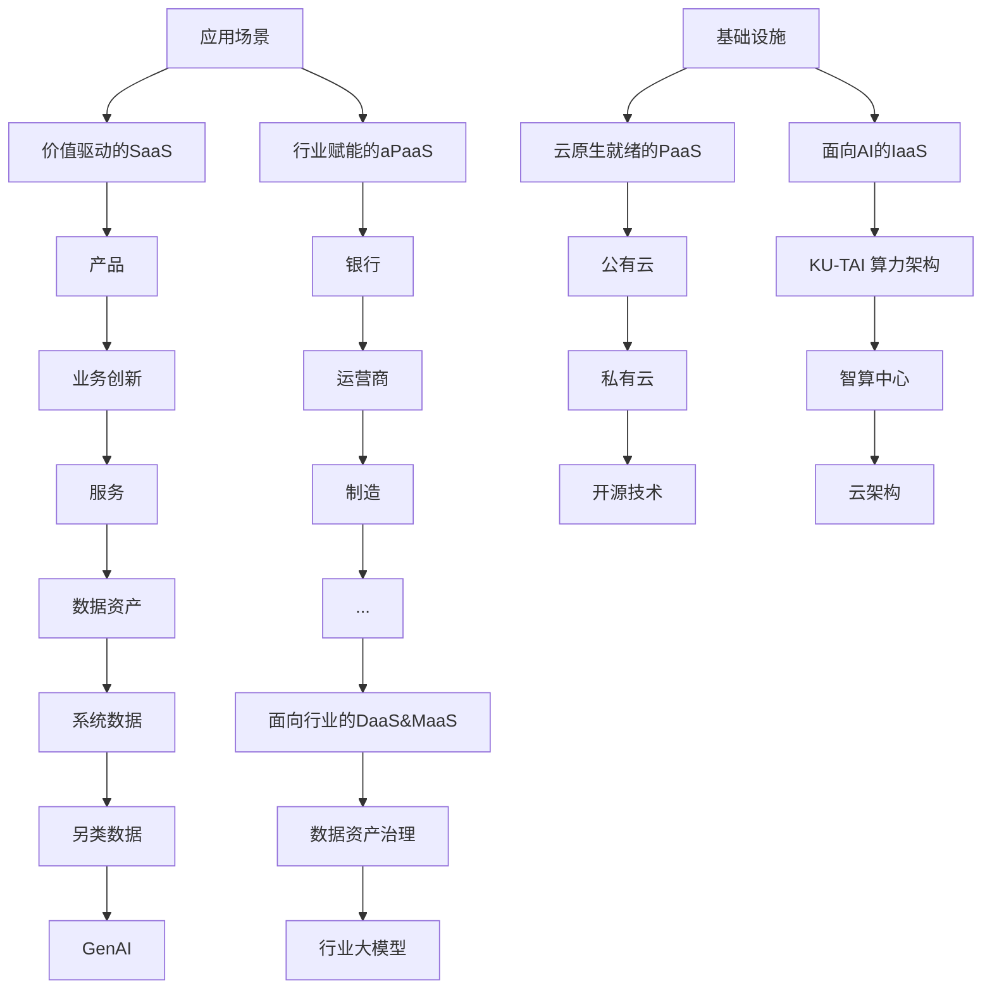

# 神州数码信息服务集团股份有限公司

2024 年半年度报告

text_image

DCITS
神州信息

2024 年 8 月

# 第一节 重要提示、目录和释义

公司董事会、监事会及董事、监事、高级管理人员保证半年度报告内容的真实、准确、完整，不存在虚假记载、误导性陈述或者重大遗漏，并承担个别和连带的法律责任。

公司负责人郭为、主管会计工作负责人刘伟刚及会计机构负责人(会计主管人员)张秀慧声明：保证本半年度报告中财务报告的真实、准确、完整。

所有董事均已出席了审议本次半年报的董事会会议。

公司已在本报告中描述了公司发展过程中可能面对的风险，敬请查阅本报告第三节“管理层讨论与分析”之“十、公司面临的风险和应对措施”的内容。敬请广大投资者注意投资风险。

公司计划不派发现金红利，不送红股，不以公积金转增股本。

# 目录

第一节 重要提示、目录和释义 ..

第二节 公司简介和主要财务指标..

第三节 管理层讨论与分析......

第四节 公司治理. . 26

第五节 环境和社会责任. .. 30

第六节 重要事项 . . 32

第七节 股份变动及股东情况.. .. 47

第八节 优先股相关情况. . 54

第九节 债券相关情况. . 55

第十节 财务报告 . . 56

# 备查文件目录

（一）载有公司负责人、主管会计工作负责人、会计机构负责人签名并盖章的财务报表。

（二）报告期内在《证券时报》及巨潮资讯网（www.cninfo.com.cn）上公开披露过的所有公司文件的正本及公告的原稿。

神州数码信息服务集团股份有限公司

董事长：郭为

2024 年 8 月 31 日

释义

<table><tr><td>释义项</td><td>指</td><td>释义内容</td></tr><tr><td>本公司、公司、神州信息、本集团</td><td>指</td><td>神州数码信息服务集团股份有限公司</td></tr><tr><td>太光电信、*ST 太光</td><td>指</td><td>深圳市太光电信股份有限公司</td></tr><tr><td>神州控股</td><td>指</td><td>神州数码控股有限公司</td></tr><tr><td>神州数码</td><td>指</td><td>神州数码集团股份有限公司</td></tr><tr><td>神码软件</td><td>指</td><td>神州数码软件有限公司</td></tr><tr><td>中新创投</td><td>指</td><td>中新苏州工业园区创业投资有限公司</td></tr><tr><td>华亿投资</td><td>指</td><td>Infinity I-China Investments (Israel), L.P.</td></tr><tr><td>南京汇庆</td><td>指</td><td>霍尔果斯汇庆天下股权投资管理合伙企业(有限合伙)(原名为南京汇庆天下科技有限公司)</td></tr><tr><td>申昌科技</td><td>指</td><td>昆山市申昌科技有限公司</td></tr><tr><td>中国证监会、证监会</td><td>指</td><td>中国证券监督管理委员会</td></tr><tr><td>中农信达</td><td>指</td><td>北京中农信达信息技术有限公司</td></tr><tr><td>华苏科技</td><td>指</td><td>南京华苏科技有限公司</td></tr><tr><td>信息系统公司</td><td>指</td><td>神州数码信息系统有限公司</td></tr><tr><td>旗硕科技</td><td>指</td><td>北京旗硕基业科技股份有限公司</td></tr><tr><td>君信宜知</td><td>指</td><td>上海君信宜知网络科技有限公司</td></tr><tr><td>融信软件</td><td>指</td><td>神州数码融信软件有限公司</td></tr><tr><td>融信云</td><td>指</td><td>神州数码融信云技术服务有限公司</td></tr><tr><td>《公司法》</td><td>指</td><td>《中华人民共和国公司法》</td></tr><tr><td>《证券法》</td><td>指</td><td>《中华人民共和国证券法》</td></tr><tr><td>《上市规则》</td><td>指</td><td>《深圳证券交易所股票上市规则》</td></tr><tr><td>公司章程</td><td>指</td><td>神州数码信息服务集团股份有限公司章程</td></tr><tr><td>股东大会</td><td>指</td><td>神州数码信息服务集团股份有限公司股东大会</td></tr><tr><td>董事会</td><td>指</td><td>神州数码信息服务集团股份有限公司董事会</td></tr><tr><td>监事会</td><td>指</td><td>神州数码信息服务集团股份有限公司监事会</td></tr><tr><td>元、万元、亿元</td><td>指</td><td>人民币元、人民币万元、人民币亿元</td></tr><tr><td>报告期、本报告期</td><td>指</td><td>2024年1月1日至2024年6月30日</td></tr></table>

# 第二节 公司简介和主要财务指标

# 一、公司简介

<table><tr><td>股票简称</td><td>神州信息</td><td>股票代码</td><td>000555</td></tr><tr><td>股票上市证券交易所</td><td colspan="3">深圳证券交易所</td></tr><tr><td>公司的中文名称</td><td colspan="3">神州数码信息服务集团股份有限公司</td></tr><tr><td>公司的中文简称</td><td colspan="3">神州信息</td></tr><tr><td>公司的外文名称</td><td colspan="3">Digital China Information Service Company Ltd.</td></tr><tr><td>公司的外文名称缩写</td><td colspan="3">DCITS</td></tr><tr><td>公司的法定代表人</td><td colspan="3">郭为</td></tr></table>

# 二、联系人和联系方式

<table><tr><td></td><td>董事会秘书</td><td>证券事务代表</td></tr><tr><td>姓名</td><td>刘伟刚</td><td>李丹</td></tr><tr><td>联系地址</td><td>北京市海淀区西北旺东路10号院东区18号楼神州信息大厦</td><td>北京市海淀区西北旺东路10号院东区18号楼神州信息大厦</td></tr><tr><td>电话</td><td>010-61853676</td><td>010-61853676</td></tr><tr><td>传真</td><td>010-62694810</td><td>010-62694810</td></tr><tr><td>电子信箱</td><td>dcits-ir@dcits.com</td><td>dcits-ir@dcits.com</td></tr></table>

# 三、其他情况

# 1、公司联系方式

公司注册地址、公司办公地址及其邮政编码、公司网址、电子信箱等在报告期是否变化

适用 □不适用

<table><tr><td>公司注册地址</td><td>深圳市南山区沙河街道东方社区深湾二路82号神州数码国际创新中心东塔3905</td></tr><tr><td>公司注册地址的邮政编码</td><td>518000</td></tr><tr><td>公司办公地址</td><td>无变动</td></tr><tr><td>公司办公地址的邮政编码</td><td>无变动</td></tr><tr><td>公司网址</td><td>无变动</td></tr><tr><td>公司电子信箱</td><td>无变动</td></tr><tr><td>临时公告披露的指定网站查询日期</td><td>2024年05月30日</td></tr><tr><td>临时公告披露的指定网站查询索引</td><td>http://static.cninfo.com.cn/finalpage/2024-05-30/1220197521.PDF</td></tr></table>

# 2、信息披露及备置地点

信息披露及备置地点在报告期是否变化

□适用 不适用

公司披露半年度报告的证券交易所网站和媒体名称及网址，公司半年度报告备置地在报告期无变化，具体可参见 2023 年年报。

# 3、其他有关资料

其他有关资料在报告期是否变更情况

□适用 不适用

# 四、主要会计数据和财务指标

公司是否需追溯调整或重述以前年度会计数据

□是 否

<table><tr><td></td><td>本报告期</td><td>上年同期</td><td>本报告期比上年同期增减</td></tr><tr><td>营业收入(元)</td><td>4,096,145,450.41</td><td>4,247,003,453.49</td><td>-3.55%</td></tr><tr><td>归属于上市公司股东的净利润(元)</td><td>-76,534,117.83</td><td>80,869,774.14</td><td>-194.64%</td></tr><tr><td>归属于上市公司股东的扣除非经常性损益的净利润(元)</td><td>-82,323,883.01</td><td>54,216,167.33</td><td>-251.84%</td></tr><tr><td>经营活动产生的现金流量净额(元)</td><td>-1,686,834,316.68</td><td>-1,031,403,127.17</td><td>-63.55%</td></tr><tr><td>基本每股收益(元/股)</td><td>-0.0794</td><td>0.0837</td><td>-194.86%</td></tr><tr><td>稀释每股收益(元/股)</td><td>-0.0794</td><td>0.0837</td><td>-194.86%</td></tr><tr><td>加权平均净资产收益率</td><td>-1.24%</td><td>1.33%</td><td>-2.57%</td></tr><tr><td></td><td>本报告期末</td><td>上年度末</td><td>本报告期末比上年度末增减</td></tr><tr><td>总资产(元)</td><td>12,194,621,670.35</td><td>12,815,505,492.23</td><td>-4.84%</td></tr><tr><td>归属于上市公司股东的净资产(元)</td><td>6,083,082,072.93</td><td>6,232,286,669.17</td><td>-2.39%</td></tr></table>

# 五、境内外会计准则下会计数据差异

# 1、同时按照国际会计准则与按照中国会计准则披露的财务报告中净利润和净资产差异情况

□适用 不适用

公司报告期不存在按照国际会计准则与按照中国会计准则披露的财务报告中净利润和净资产差异情况。

# 2、同时按照境外会计准则与按照中国会计准则披露的财务报告中净利润和净资产差异情况

□适用 不适用

公司报告期不存在按照境外会计准则与按照中国会计准则披露的财务报告中净利润和净资产差异情况。

# 六、非经常性损益项目及金额

适用 □不适用

单位：元

<table><tr><td>项目</td><td>金额</td><td>说明</td></tr><tr><td>非流动性资产处置损益(包括已计提资产减值准备的冲销部分)</td><td>181,856.08</td><td></td></tr><tr><td>计入当期损益的政府补助(与公司正常经营业务密切相关、符合国家政策规定、按照确定的标准享有、对公司损益产生持续影响的政府补助除外)</td><td>506,908.80</td><td></td></tr><tr><td>除同公司正常经营业务相关的有效套期保值业务外,非金融企业持有金融资产和金融负债产生的公允价值变动损益以及处置金融资产和金融负债产生的损益</td><td>4,486,625.35</td><td></td></tr><tr><td>单独进行减值测试的应收款项减值准备转回</td><td>4,897,864.09</td><td></td></tr><tr><td>除上述各项之外的其他营业外收入和支出</td><td>-3,982,887.25</td><td></td></tr><tr><td>减:所得税影响额</td><td>32,821.44</td><td></td></tr><tr><td>少数股东权益影响额(税后)</td><td>267,780.45</td><td></td></tr><tr><td>合计</td><td>5,789,765.18</td><td></td></tr></table>

其他符合非经常性损益定义的损益项目的具体情况：

□适用 不适用

公司不存在其他符合非经常性损益定义的损益项目的具体情况。

将《公开发行证券的公司信息披露解释性公告第 1 号——非经常性损益》中列举的非经常性损益项目界定为经常性损益项目的情况说明

□适用 不适用

公司不存在将《公开发行证券的公司信息披露解释性公告第 1 号——非经常性损益》中列举的非经常性损益项目界定为经常性损益的项目的情形。

# 第三节 管理层讨论与分析

# 一、报告期内公司从事的主要业务

公司需遵守《深圳证券交易所上市公司自律监管指引第 3 号——行业信息披露》中的“软件与信息技术服务业”的披露要求

《数字经济 2024 年工作要点》提出要“加快推动数字技术创新突破，深化关键核心技术自主创新，提升核心产业竞争力”。我们正在进入数字化时代，以云原生、数字原生和人工智能技术为代表的技术架构的变化，使得数云融合成为企业数字化转型的战略愿景。云原生技术推动了企业的敏捷业务能力的构建，数字原生技术使得数据成为驱动企业转型变革的核心资产。企业的数字化转型，即是通过数据资产化能力和业务敏捷化能力的深度、全面的融合形成企业的数字化竞争力，从而强化企业在市场环境中的韧性，不断地进行业务场景创新，构建新的业务增长引擎。

flowchart

数据资产的累积，已成为数字化时代企业业务创新迭代最重要的支撑点。数据资产定价和分类的复杂性需要产生新的数据管理工具，数据治理工具可以帮助企业管理和治理数据资产。拥有数据资产管理平台后，企业可以快速创新服务和产品。在云架构下，我们提供应用基础架构，即 aPaaS，通过提供一系列专业能力工具帮助企业进行重新编排。相应的，云原生就绪的 PaaS 可以为应用基础架构提供更好的支撑，下面还有公共资源，即数字化的基础设施 IaaS，大致可分为两类，一类是开源，另一类是公有云。在数云融合的架构下搭建技术体系，支撑基于泛在敏捷业务能力的数据资产化将成为完成数字化转型的核心，这也是数字化同信息化的本质不同。

# （一）金融科技行业趋势

金融科技是数字经济的重要组成部分，为金融业的高质量发展注入了充沛动力。在中央金融工作会议精神指引下，做好“科技、绿色、普惠、养老、数字”五篇金融大文章，成为国内银行深入推动金融供给侧结构性改革，更好服务实体经济的重要抓手和数字化转型重点方向。公司始终将金融科技战略与数字经济发展的大趋势以及中央部署的“五篇金融大文章”紧密结合，努力成为领先的金融数字化转型合作伙伴。在科技金融领域，公司积极投入研发资源，利用先进的技术手段，如人工智能、大数据分析等，帮助银行提升风险评估和信贷审批的效率与准确性，为科技创新企业提供更精准、高效的金融服务。在绿色金融领域，公司凭借强大的数据分析能力，协助银行建立绿色金融评价体系，对绿色项目和企业进行有效识别和支持，推动资金流向环保、节能等绿色产业。在普惠金融领域，公司通过搭建数字化平台，降低金融服务的门槛和成本，让更多的小微企业能够享受到便捷、公平的金融服务。在养老金融领域，公司利用大数据和智能算法，为银行开发个性化的养老金融产品，满足不同年龄段和收入水平人群的养老需求。在数字金融领域，公司致力于为银行打造安全、高效、智能的数字金融服务体系，提升客户体验，优化业务流程，助力银行在数字化时代提升核心竞争力。

中国信通院发布的《全球数字经济白皮书（2024年）》指出，我国数字经济整体保持稳健增长，2023年中国数字经济核心产业增加值预计超过12万亿元，占GDP的比重为10%左右。数字化探索正在发生系统性、深层次变革，数字原生企业利用“数据+技术”持续探索价值发现新模式，数字化转型带动支撑产业创新演变，形成新的增长动力，数实融合步伐不断加快。工信部赛迪研究院《2023中国银行业IT解决方案市场预测分析报告》指出，在加快数字化转型与自主创新的推动下，中国银行业在金融科技投入上继续保持相对稳健的增长态势，2023年度中国银行业整体IT投资规模达到2,707.13亿元，同比增长5.88%。其中，中国银行业IT解决方案2023年市场规模为604.71亿元，同比增长10.8%。预计到2028年，中国银行业IT解决方案市场规模将达到927.75亿元，2024到2028年的年均复合增长率为8.67%。未来的三到五年时间内，在加快数字化转型与自主创新以及AIGC的不断推动下，中国银行业IT解决方案将步入智能化升级的新时期。

# （二）金融科技主要业务

公司以“科技金融、绿色金融、普惠金融、养老金融、数字金融”金融五篇大文章为方向，以数字化的力量为驱动，通过“数字技术+数据要素”的融合创新，持续实现产品、服务的创新迭代，为金融机构及泛行业客户，提供全方位的信息科技建设服务。

# 1、金融业务驱动的金融科技产品与解决方案

公司拥有全面的金融科技产品和解决方案谱系，形成包括核心应用、云计算、数据智能、智能银行、开放金融、移动互联、信贷、风险管理在内的八大产品族以及从咨询、实施到运维的全面服务，为银行客户的金融科技需求提供全面支撑，公司在分布式架构平台建设、核心系统建设、渠道管理建设、开放银行建设和数据、业务、支付等中台化建设方面处于国内领先地位，相关产品连续多年在IDC、赛迪研究院等专业第三方市场统计中排名第一。

在推动银行架构演进发展方面，公司以ModelB@nk5.0银行应用架构为指引“蓝图”，基于“数云融合”的技术范式，融入云原生、微服务、人工智能、大数据等数字技术，以技术中台、数据中台以及金融超脑为支柱，围绕“场景建设”

“旅程服务”“能力输出”“资源积累”“组织管理”五个层次业务发展提供清晰的数字化支撑能力，支撑数字金融可持续发展。

# 2、金融行业信息技术应用创新

公司同时拥有国家尖端IT基础设施建设与金融解决方案自主研发能力，能够一站式、多维度满足客户在金融信创领域的需求，帮助金融机构打造云原生数字化安全底座，为国有大行、股份制、城商行及保险、证券等金融机构提供信创咨询及项目管理服务。通过信创架构规划设计、银行系统信创解决方案、信创全适配服务、信创云和分布式基础设施、信创集成和运维服务，为各类型商业银行提供全栈金融信创服务。此外，为服务银行核心业务系统的信创化改造，公司与腾讯、华为、飞腾、兆芯、阿里等生态合作伙伴实现了全栈国产化基础软硬件适配，全面满足各类型商业银行对核心业务系统高性能、高稳定性、高可靠性的金融级应用要求。

# 3、金融数据领域开发与服务

数据是数字经济时代的重要生产要素，在建设数字中国和金融强国两大背景下，公司依托多年的行业数字化积累，推进金融行业数据资产管理、运营和业务赋能，同时，通过金融科技与行业数字化业务的融合，开创了“科技+数据+场景”融合创新的场景金融新模式，助力金融创新和金融数字化转型。公司紧随银行业数据资产化以及数据要素深入探索，围绕数据资产盘点、价值评估、资产运营、资产入表等方面研究和实践，形成了一套金融数据资产管控体系，结合多年来数据治理、数据管控以及数据资产管理与运营，建立起来全域数据资产管理平台，为金融客户提供全面数据资产管理咨询和方案落地。同时，在公司ModelB@ank5.0整体解决方案框架下，数据中台理念作为其重要组织部分，为金融客户提供数据汇聚、资产管理、数据服务、敏捷应用、治理管控五维一体完整的数据解决方案。在中小微场景金融方面，公司依托全量数据风控能力与核心大数据技术服务能力，围绕“信贷、金融风控、模型智能”等重点产品，打造金融信贷一体化综合服务。

# （三）行业地位和市场影响力

公司在金融科技领域的前沿创新与实践获得业界高度认可。据工信部赛迪研究院和IDC报告显示，公司2023年度持续领跑中国银行业核心业务系统、渠道管理以及开放银行等领域，在商业智能、信贷、移动银行、中间业务、风险管理、监管报送、支付清算以及智慧网点等领域都取得新的进展。其中，银行核心业务系统和渠道管理系统领域已经连续十二年蝉联第一，保持市场领先。

报告期内，公司入选“2023毕马威中国金融科技企业双50”榜单、2023年度信创产业领军企业100强、2023信创产业TOP100、《互联网周刊》2023-2024智能运维企业TOP50，入围中国软件行业协会“中国软件产业贡献企业”、中国电子工业标准化技术协会信息技术应用创新工作委员会“2023年度信创工委会卓越贡献成员单位”，“九天揽月云原生金融PaaS平台”荣获中国科协科学技术创新部、中国通信学会举办的“科创中国”金融科技创新大赛(2023)三等奖，公司三项解决方案入选金融信创生态实验室“第三期金融信创优秀解决方案”，公司助力金融客户打造的视频银行项目荣获《亚洲银行家》“2024中国奖计划-中国区域最佳身份验证技术实施”大奖。

# 二、核心竞争力分析

# 1、以科技研发为本，构筑行业领先的技术能力

报告期内，公司研发费用达2.6亿元人民币，研发投入水平在业内持续领先。公司软件著作权及专利累计达1,965项，其中专利127件，软件著作权1,838件，拥有从平台底层到应用层的全部源代码和自主知识产权。未来公司计划通过再融资等形式筹措资金，持续加大研发投入，全面优化研发机制，加强与科研院校等机构的协同合作，不断扩展公司现有产品线，增强自主核心技术的积累，为公司长期持续稳定的发展打造稳固的技术护城河。

报告期内，公司基于数云融合理念，通过多平台融合、多技术栈融合、多工具融合，打造了银行业具备全价值链特点的数字化转型支撑底座——“乾坤”企业级数智底座。“乾坤”具备六大核心优势，包含一套端到端的企业级数字化工艺流程，支持“迁移”和“新建”两种云原生演进策略，支持“高码”、“低码”、“零码”三种开发模式，提供四大数字化资产库，支持五大类业务应用开发，完整覆盖数字化转型工作六大工作域。“乾坤”企业级数智底座是数云融合在金融行业的落地，为金融机构推动数字金融建设、实现科技强基与技术固本提供了新的思路与方向，有利于公司未来进一步助推金融行业数字化转型，推动金融科技新的发展。

公司以AIGC为核心，融合多种“AI+”技术，成功实现“九天揽月云原生金融PaaS平台”的智能迭代，实现了“工艺规范”、“资产沉淀”、“智能生成”三大升级。公司以“九天揽月”为基石，以业务建模为抓手，将AI跟金融软件的全生命周期相融合，从业务规划到建模，从设计、开发到测试，再到持续集成、部署以及运维，通过全过程的数字化和智能化，重塑金融软件全生命周期工艺流程，成功破解金融行业研发创新投入大、周期长的难点，全面推动金融数字化转型。

# 2、立足成就客户，打造全栈金融数字化能力

公司通过“技术+服务”，形成包括“咨询/规划、解决方案、适配服务、分布式基础设施、集成/运维”等在内的全栈信创服务能力。截至目前，已经持续为百余家金融机构提供信创咨询、信创软硬件采购、信创适配验证、信创集成及信创运维等全面服务。2024 年 5 月，公司发布《引领数智金融新未来：金融数字化转型白皮书》，整合了公司最新的产品能力和解决方案，包括咨询规划、业务类解决方案、数字化底座、质量测试和数字化未来趋势等方面的内容，全面构建金融数字化转型的产品与能力。在解决方案层面，报告期内，公司“一体化数据智能开发平台”、“数据资产平台”和“支付中台”等三项解决方案成功入选金融信创生态实验室评选的“第三期金融信创优秀解决方案”，其中“数据资产平台”解决方案入选“实验室推荐优秀解决方案”。截至目前，公司包括“全栈国产化分布式核心业务系统”、“企业级微服务平台”、“智能综合前端”、“企业服务总线”、“智能自主交易平台”、“六合上甲数据智能平台”、“数据资产平台”、“支付中台”在内的十余款金融解决方案，在经过大量适配认证和应用落地后，成功入选并金融信创生态实验室的优秀解决方案名单并获行业推荐。公司金融信创解决方案不仅可以高效、快捷地进行金融行业云原生应用的开发，并且对开发出来的各类资产提供企业级的全生命周期管控，支持上层业务快速创新，助力金融行业数字化转型，实现技术从“支撑使能”到“价值赋能”的转变。

# 3、携手业界合作伙伴，共筑金融科技产业生态

作为国家金融科技示范区核心区入驻企业、西城区重点金融科技企业，公司发展得到北京市、西城区、海淀区等地政府的支持，同时，公司在中国互联网金融协会、中国支付清算协会、中国金融学会金融科技专业委员会、北京金融科技产业联盟、中国电子学会、中国电子信息行业联合会、中国电子工业标准化技术协会等多个金融、科技领域社会团体担任重要职位，积极参与中国金融科技产业发展研究、技术攻关等相关工作。持续与国家级金融智库“国家金融与发展实验室”展开深入合作，与清华大学、中国科学技术大学、北京航空航天大学、西南财经大学等国内顶尖高校建立产学研合作，并与中国科学技术大学共同成立“数字智能决策联合实验室”。

报告期内，公司与北京国家金融科技认证中心举行合作签约仪式。双方充分发挥各自优势，资源共享，优势互补，紧密合作共同打造“金融+科技+产业+标准”的数字金融新生态，加强在数字金融、数据资产、数据智能、数据保护等领域的合作，充分发挥数据的基础要素作用，打造数据生产力，将金融产品和服务广泛地融入数字经济，助力数字经济与实体经济的融合。为金融机构提供安全、便捷、可靠的数字金融、数字科技服务。公司与腾讯云就“TMF移动开发平台”达成战略合作，共同开展市场拓展与技术研发工作。公司与华为正式签署“鸿蒙生态千帆计划”，成为华为鸿蒙“HarmonyOS”首批认证开发服务商，将推出“鸿蒙版”银行全渠道金融解决方案。公司携手政产学研等伙伴共同构建具有活力、创新力和影响力的产业生态圈，推动金融科技高质量发展。

# 4、凭借深厚行业积累，贡献国内外金融数字化标准

公司以金融“五篇大文章”精神为指引，以“数字技术+数据要素”积极支撑金融产品和服务创新，凭借科技领先、数据领先、模式领先、人才领先的核心优势引领金融业数字生态建设并深化金融标准化开放，助力相关先进产品不断转化为标准，将更好地产品服务推向客户，以高标准引领新质生产力发展。报告期内，公司主导、参编各类标准获批发布共66项，在研各类标准共计62项。在国内方面，参编《金融科技服务能力评价指标》、《金融信息数据交换系统接口规范》两标准获批发布，助推行业数字化能力规范前行。连续三年蝉联央行金融信息服务-应用程序接口领域“领跑者”榜单，是入选企业中唯一连续上榜的金融科技公司，巩固公司金融科技领军企业形象。在海外方面，通过参与ISO相关标准研制以增强公司在行业影响力，树立行业领军形象；通过参与BAIN组织标准化工作，提升软实力并增强解决方案和产品竞争力，助力业务实现拓展。推动与SWIFT生态合作，引入国际标准并实践以更好服务于金融机构客户，通过不断产生实践新的标准化成果，来提升更大效能，增强自身产品和解决方案竞争力。

# 三、主营业务分析

# 1、概述

公司积极响应国家数字经济顶层战略规划，牢牢把握数字化转型的机遇，报告期内公司实现营业收入 40.96 亿元，同比下降 3.55%，业务规模保持稳定，其中软件开发和技术服务收入 26.29 亿元，同比增长 4.57%，业务结构持续优化。公司一方面受到行业激烈竞争的影响，业务毛利率较去年同期下降 3.29 个百分点，另一方面为扩大金融科技战略业务规模，加大了对新产品线的相关投入，导致公司归母净利润和扣非净利润较上年同期下降，实现归属于上市公司股东的净利润-0.77亿元，归属于上市公司股东的扣除非经常性损益的净利润-0.82 亿元。

# （一）坚定推进数云融合的金融科技战略

公司持续聚焦金融科技赛道，报告期内，由于银行业整体经营承压，信息化预算增速放缓，公司金融业务发展受到一定影响，但整体保持稳定。其中金融系统集成业务受行业竞争及招投标推迟等因素影响较大，金融软服业务保持稳中有进，总体业务结构持续优化。金融行业实现营业收入 20.13 亿元，同比下降 0.83%，其中金融系统集成业务收入 4.25 亿元，同比下降 39.58%，金融软服业务收入 15.88 亿元，同比增长 19.69%。金融行业签约额达到 22.97 亿元，同比下降 0.63%，其中金融软服业务签约额 18 亿元，同比增长 10.84%。公司在手订单为持续聚焦金融科技战略打下坚实基础，报告期内金融业务已签未销 28.33 亿元，同比增长 8.17%，其中金融软服业务已签未销 23.34 亿元，同比增长 20.53%。

# 1.1以客户为中心的市场拓展持续深入

公司大客户战略顺利推进，国有大行、股份制银行、省农信等重点客户持续取得突破。金融软服业务在国有大行收入同比增长35.45%，前十大客户收入总金额同比增长21.14%。同时，入围交通银行、恒丰银行、上海银行等软件资源池框架，与农业银行、邮储银行、招商银行、光大银行、兴业银行等客户签约金额同比大幅增长，金融软服签约总额2,000万元以上的客户达到22家，同比增加6家。

# 1.2金融科技产品与解决方案能力行业领先

公司在核心业务系统领域持续保持优势，报告期内，新一代核心中标某股份制大行新核心项目，获得头部大行客户的认可，中标某经济大省省农信项目，持续深耕于省级农信市场；中标中部某省万亿资产体量城商行项目，重点战略客户再次取得突破，中标广东、天津、江苏等地农商银行核心项目，区域性农商行客户多点开花。同时，公司将持续降本增效，重点优化项目管理，提升并行交付能力与规模，并行核心项目交付数量再创新高。报告期内，公司企业级微服务平台及企业服务总线（ESB）继续保持市场领先地位，中标浙江农商、黑龙江农商、广西农商、南海农商、秦农等农信银行及四川、温州、贵阳等区域城商行，架构治理平台中标红塔银行和广发银行等客户。同时，重点新研产品—财资系统经过屡次迭代和升级，取得实质市场突破，中标浙商银行财资云平台、北京农商交易银行和江阴农商现金管理平台等标杆客户。数字金融业务为多家银行的数字化转型赋能。报告期内，整合积分权益、智能营销、运营陪跑等解决方案，形成大零售业务能力，直接帮助银行业务部门提升客群运营能力；电子渠道建设、远程银行、移动展业等中标北京银行、青海银行等多家银行；海外业务拓展卓有成效，中标香港集友银行企业网银、澳门国际银行企业网银。

# 1.3金融科技产品谱系日趋完善

公司作为金融科技行业的领先企业，致力于打造全面且有竞争力的解决方案产品，以全栈金融数字化能力深度服务客户。公司大力培育信贷业务、资产负债和风险管理解决方案条线，补充金融科技产品版图。公司新一代信贷产品解决方案，基于行业首个云原生金融PaaS平台—“九天揽月”打造，可满足银行客户信贷业务全流程需求。报告期内，中标中信银行贷后预警监控项目及中国农业发展银行信贷项目，打造头部大行标杆案例；中标签约四川农商、广西农商等多个客户，区域农商行市场逐步突破；入围广州银行、深农商、国银金租、武汉融资担保等信贷定制服务，进一步提升金融及泛金融客户粘性。公司风险管理解决方案帮助金融机构建立体系化、标准化、合规化的风险管理政策、制度、模型和工具，报告期内获得中国农业发展银行、中信银行、光大银行和广发银行等大客户认可，提供了从全面风险管理、RWA、信用风险和市场风险管理及资本计量整体服务。公司资产负债业务通过事前规划、事中管控和事后检视的闭环经营管理，提升商业银行资产负债主动管理能力，报告期内，签约广发银行系统优化项目、广东农信资金定价系统及奇瑞金融预算管理项目，中标中信银行项目管理平台，浙商银行定价管理系统及温州银行管会系统等项目。

# 1.4金融数据资产领域持续发力

公司一体化数据开发平台具备数据全生命周期的开发、管理能力，实现了数据需求、数据采集、数据开发、数据治理等从需求到服务的全链路闭环，报告期内，在内蒙古农信、陕西农信、湖南银行和云南富滇等多家银行落地实施；数据资产解决方案和全域数据资产产品发布，借助先进的方案理念，签约中标陕西农信、湖南银行、云南红塔银行、泰隆银行等客户；指标标签、驾驶舱可视化等解决方案成功落单贵州农信、福建农信、齐鲁银行、郑州银行、西安银行等，持续探索数据风控和数据营销等新兴解决方案，并在江南银行、天津银行等落地实施。同时，公司参与编制的《金融数据资产估值与交易研究》正式发布，围绕金融数据资产估值与交易主线，创新提出数据资产估值与入表的新思路、新方法。

# 1.5积极拓展金融科技“出海”业务

当前部分国家和地区的数字金融渗透率较低，为中国金融科技企业提供了更为广阔的发展空间。公司持续升级海外数字金融一体化解决方案的产品升级，针对海外银行客户的特点，发挥解决方案技术栈统一、先进的模块化架构设计优势，从功能覆盖、实施效率和使用体验等多方面持续提升产品竞争力。

报告期内，中标签约马来西亚某银行和加拿大某银行信贷系统项目、香港集友银行和澳门国际银行企业网银项目，服务能力获得海外客户认可。成功签约新加坡海湾核心项目，继汇丰银行后进一步夯实海外银行数字化建设基础。同时，公司持续有序推进汇丰银行核心项目群等重点项目的交付工作，依托新加坡海外平台与海外金融科技公司达成合作协议共同拓展当地市场，为海外业务拓展打下坚实基础。

# （二）行业数字化业务稳中有升

报告期内，公司政企业务实现收入15.5亿元，其中软件和服务业务实现收入6.19亿元，同比增长8.08%。在财税数字化领域，公司基于多年参与金税工程的业务和技术优势，深度参与金税三期和四期项目建设，在区块链新技术探索、国家信息工程网络安全防护响应、混合云应用研究、大数据技术应用、不同部委数据共享等多个方面，持续推动财税数字化建设。报告期内，中标签约国家税务总局多边税务数据服务平台升级完善及运维项目，参与到北京、浙江、江苏、山西等21个省级税务局的数据交换共享、管理决策支持核算与分析系统、智慧税务办公平台建设等多个项目中，同时积极推进多个地市级税务局的信息系统建设。未来公司将继续围绕金税工程，积极推进征管效能从“以票控税”到“以数治税”的转变，凭借深厚的技术沉淀和领先的项目经验优势，更好地服务于税费治理全面数字化工作。在行业信创领域，公司聚焦中石油、中国烟草等重点客户，围绕客户的业务场景深入打造行业差异化能力，提升业务价值和业务粘性，打造智能工厂、双碳能耗两大解决方案，重点布局算力中心业务，中标中国烟草信创云北京节点总集成项目，树立了行业标杆。

报告期内，公司运营商业务实现收入 5.24 亿元，其中软件和服务业务收入 4.15 亿元。公司是国内领先的移动通信无线网络运维服务和大数据服务供应商，依托深厚的技术底蕴和本地化交付资源，持续推进通信大数据与移动网络优化解决方案的同时，积极拓展云集成、IT 运维、数通等方面的新业务品类，谋求新的业务增长点。

主要财务数据同比变动情况

单位：元

<table><tr><td></td><td>本报告期</td><td>上年同期</td><td>同比增减</td><td>变动原因</td></tr><tr><td>营业收入</td><td>4,096,145,450.41</td><td>4,247,003,453.49</td><td>-3.55%</td><td></td></tr><tr><td>营业成本</td><td>3,543,772,966.72</td><td>3,534,744,773.66</td><td>0.26%</td><td></td></tr><tr><td>销售费用</td><td>191,659,430.19</td><td>202,947,384.16</td><td>-5.56%</td><td></td></tr><tr><td>管理费用</td><td>120,012,452.03</td><td>100,321,094.17</td><td>19.63%</td><td></td></tr><tr><td>财务费用</td><td>17,149,895.20</td><td>8,144,767.09</td><td>110.56%</td><td>报告期内利息收入减少所致</td></tr><tr><td>所得税费用</td><td>-10,076,186.61</td><td>-12,260,421.86</td><td>17.82%</td><td></td></tr><tr><td>研发投入</td><td>271,893,471.65</td><td>282,174,198.47</td><td>-3.64%</td><td></td></tr><tr><td>经营活动产生的现金流量净额</td><td>-1,686,834,316.68</td><td>-1,031,403,127.17</td><td>-63.55%</td><td>报告期内采购付款、接受劳务支付现金增加所致</td></tr><tr><td>投资活动产生的现金流量净额</td><td>-20,615,277.00</td><td>298,418,680.56</td><td>-106.91%</td><td>报告期内赎回理财产品减少所致</td></tr><tr><td>筹资活动产生的现金流量净额</td><td>835,572,157.16</td><td>-30,103,706.71</td><td>2,875.65%</td><td>报告期内取得银行借款增加所致</td></tr><tr><td>现金及现金等价物净增加额</td><td>-871,924,920.87</td><td>-762,547,685.07</td><td>-14.34%</td><td></td></tr></table>

公司报告期利润构成或利润来源发生重大变动

□适用 不适用

公司报告期利润构成或利润来源没有发生重大变动。

营业收入构成  
单位：元

<table><tr><td rowspan="2"></td><td colspan="2">本报告期</td><td colspan="2">上年同期</td><td rowspan="2">同比增减</td></tr><tr><td>金额</td><td>占营业收入比重</td><td>金额</td><td>占营业收入比重</td></tr><tr><td>营业收入合计</td><td>4,096,145,450.41</td><td>100%</td><td>4,247,003,453.49</td><td>100%</td><td>-3.55%</td></tr><tr><td colspan="6">分行业</td></tr><tr><td>金融</td><td>2,012,868,972.01</td><td>49.14%</td><td>2,029,691,682.58</td><td>47.79%</td><td>-0.83%</td></tr><tr><td>政企</td><td>1,549,889,606.88</td><td>37.84%</td><td>1,387,969,897.31</td><td>32.68%</td><td>11.67%</td></tr><tr><td>运营商</td><td>524,131,968.31</td><td>12.80%</td><td>725,071,151.72</td><td>17.07%</td><td>-27.71%</td></tr><tr><td>其他</td><td>9,254,903.21</td><td>0.22%</td><td>104,270,721.88</td><td>2.46%</td><td>-91.12%</td></tr><tr><td colspan="6">分产品</td></tr><tr><td>软件开发及技术服务</td><td>2,629,141,371.39</td><td>64.19%</td><td>2,514,183,306.83</td><td>59.20%</td><td>4.57%</td></tr><tr><td>系统集成</td><td>1,464,774,848.26</td><td>35.76%</td><td>1,730,551,696.69</td><td>40.75%</td><td>-15.36%</td></tr><tr><td>其他业务</td><td>2,229,230.76</td><td>0.05%</td><td>2,268,449.97</td><td>0.05%</td><td>-1.73%</td></tr><tr><td colspan="6">分地区</td></tr><tr><td>国内地区</td><td>4,094,979,793.38</td><td>99.97%</td><td>4,245,208,590.22</td><td>99.96%</td><td>-3.54%</td></tr><tr><td>国外地区</td><td>1,165,657.03</td><td>0.03%</td><td>1,794,863.27</td><td>0.04%</td><td>-35.06%</td></tr></table>

占公司营业收入或营业利润 10%以上的行业、产品或地区情况

适用 □不适用  
单位：元

<table><tr><td></td><td>营业收入</td><td>营业成本</td><td>毛利率</td><td>营业收入比上年同期增减</td><td>营业成本比上年同期增减</td><td>毛利率比上年同期增减</td></tr><tr><td colspan="7">分行业</td></tr><tr><td>金融</td><td>2,012,868,972.01</td><td>1,700,800,326.50</td><td>15.50%</td><td>-0.83%</td><td>3.51%</td><td>-3.55%</td></tr><tr><td>政企</td><td>1,549,889,606.88</td><td>1,400,835,487.24</td><td>9.62%</td><td>11.67%</td><td>15.92%</td><td>-3.31%</td></tr><tr><td>运营商</td><td>524,131,968.31</td><td>440,471,824.30</td><td>15.96%</td><td>-27.71%</td><td>-30.76%</td><td>3.69%</td></tr><tr><td colspan="7">分产品</td></tr><tr><td>软件开发及技术服务</td><td>2,629,141,371.39</td><td>2,211,026,683.88</td><td>15.90%</td><td>4.57%</td><td>9.75%</td><td>-3.97%</td></tr><tr><td>系统集成</td><td>1,464,774,848.26</td><td>1,332,560,557.45</td><td>9.03%</td><td>-15.36%</td><td>-12.33%</td><td>-3.14%</td></tr><tr><td colspan="7">分地区</td></tr><tr><td>国内地区</td><td>4,094,979,793.38</td><td>3,542,818,210.44</td><td>13.48%</td><td>-3.54%</td><td>0.27%</td><td>-3.29%</td></tr></table>

公司主营业务数据统计口径在报告期发生调整的情况下，公司最近 1 期按报告期末口径调整后的主营业务数据

□适用 不适用

公司需遵守《深圳证券交易所上市公司自律监管指引第 3 号——行业信息披露》中的“软件与信息技术服务业”的披露要求

占公司营业收入或营业利润 10%以上的行业情况

适用 □不适用

单位：元

<table><tr><td></td><td>营业收入</td><td>营业成本</td><td>毛利率</td><td>营业收入比上年同期增减</td><td>营业成本比上年同期增减</td><td>毛利率比上年同期增减</td></tr><tr><td colspan="7">分客户所处行业</td></tr><tr><td>金融</td><td>2,012,868,972.01</td><td>1,700,800,326.50</td><td>15.50%</td><td>-0.83%</td><td>3.51%</td><td>-3.55%</td></tr><tr><td>政企</td><td>1,549,889,606.88</td><td>1,400,835,487.24</td><td>9.62%</td><td>11.67%</td><td>15.92%</td><td>-3.31%</td></tr><tr><td>运营商</td><td>524,131,968.31</td><td>440,471,824.30</td><td>15.96%</td><td>-27.71%</td><td>-30.76%</td><td>3.69%</td></tr><tr><td colspan="7">分产品</td></tr><tr><td>软件开发及技术服务</td><td>2,629,141,371.39</td><td>2,211,026,683.88</td><td>15.90%</td><td>4.57%</td><td>9.75%</td><td>-3.97%</td></tr><tr><td>系统集成</td><td>1,464,774,848.26</td><td>1,332,560,557.45</td><td>9.03%</td><td>-15.36%</td><td>-12.33%</td><td>-3.14%</td></tr><tr><td colspan="7">分地区</td></tr><tr><td>国内地区</td><td>4,094,979,793.38</td><td>3,542,818,210.44</td><td>13.48%</td><td>-3.54%</td><td>0.27%</td><td>-3.29%</td></tr></table>

主营业务成本构成

单位：元

<table><tr><td rowspan="2">成本构成</td><td colspan="2">本报告期</td><td colspan="2">上年同期</td><td rowspan="2">同比增减</td></tr><tr><td>金额</td><td>占营业成本比重</td><td>金额</td><td>占营业成本比重</td></tr><tr><td>人工及技术协作</td><td>2,010,430,869.22</td><td>56.73%</td><td>1,810,480,881.09</td><td>51.22%</td><td>11.04%</td></tr><tr><td>设备类采购款</td><td>1,452,027,527.05</td><td>40.97%</td><td>1,655,744,093.31</td><td>46.84%</td><td>-12.30%</td></tr><tr><td>其他</td><td>81,314,570.45</td><td>2.29%</td><td>68,519,799.26</td><td>1.94%</td><td>18.67%</td></tr></table>

相关数据同比发生变动 30%以上的原因说明

□适用 不适用

# 四、非主营业务分析

适用 □不适用

单位：元

<table><tr><td></td><td>金额</td><td>占利润总额比例</td><td>形成原因说明</td><td>是否具有可持续性</td></tr><tr><td>投资收益</td><td>4,134,030.41</td><td>-3.61%</td><td>处置交易性金融资产取得的投资收益、其他权益工具投资在持有期间取得的股利收入等</td><td>否</td></tr><tr><td>公允价值变动损益</td><td>511,397.25</td><td>-0.45%</td><td>交易性金融资产公允价值变动</td><td>否</td></tr><tr><td>资产减值</td><td>-96,104,780.08</td><td>83.86%</td><td>计提存货跌价、合同资产减值、应收款项预期信用损失</td><td>是</td></tr><tr><td>营业外收入</td><td>2,047,689.37</td><td>-1.79%</td><td>处置固定资产利得、无需支付的应付款项等</td><td>否</td></tr><tr><td>营业外支出</td><td>5,848,720.54</td><td>-5.10%</td><td>支付项目赔偿金、处置固定资产损失等</td><td>否</td></tr></table>

# 五、资产及负债状况分析

# 1、资产构成重大变动情况

单位：元

<table><tr><td rowspan="2"></td><td colspan="2">本报告期末</td><td colspan="2">上年末</td><td rowspan="2">比重增减</td><td rowspan="2">重大变动说明</td></tr><tr><td>金额</td><td>占总资产比例</td><td>金额</td><td>占总资产比例</td></tr><tr><td>货币资金</td><td>1,066,695,687.98</td><td>8.75%</td><td>2,119,319,657.62</td><td>16.54%</td><td>-7.79%</td><td>主要系本期采购付款、接受劳务支付现金所致</td></tr><tr><td>应收账款</td><td>2,528,659,995.35</td><td>20.74%</td><td>2,915,237,310.18</td><td>22.75%</td><td>-2.01%</td><td></td></tr><tr><td>合同资产</td><td>2,418,465,475.28</td><td>19.83%</td><td>2,324,218,210.85</td><td>18.14%</td><td>1.69%</td><td></td></tr><tr><td>存货</td><td>2,623,623,568.68</td><td>21.51%</td><td>1,966,463,340.96</td><td>15.34%</td><td>6.17%</td><td>主要系未完工程增加所致</td></tr><tr><td>投资性房地产</td><td>12,330,099.60</td><td>0.10%</td><td>12,515,824.95</td><td>0.10%</td><td>0.00%</td><td></td></tr><tr><td>长期股权投资</td><td>35,385,368.15</td><td>0.29%</td><td>36,136,558.96</td><td>0.28%</td><td>0.01%</td><td></td></tr><tr><td>固定资产</td><td>402,417,565.57</td><td>3.30%</td><td>411,271,523.62</td><td>3.21%</td><td>0.09%</td><td></td></tr><tr><td>使用权资产</td><td>45,881,689.23</td><td>0.38%</td><td>51,904,155.24</td><td>0.41%</td><td>-0.03%</td><td></td></tr><tr><td>短期借款</td><td>984,266,328.24</td><td>8.07%</td><td>56,238,505.29</td><td>0.44%</td><td>7.63%</td><td>主要系取得银行借款所致</td></tr><tr><td>合同负债</td><td>1,211,879,196.87</td><td>9.94%</td><td>1,486,904,271.49</td><td>11.60%</td><td>-1.66%</td><td></td></tr><tr><td>长期借款</td><td>49,693,337.70</td><td>0.41%</td><td>55,600,000.00</td><td>0.43%</td><td>-0.02%</td><td></td></tr><tr><td>租赁负债</td><td>21,522,266.23</td><td>0.18%</td><td>28,212,479.08</td><td>0.22%</td><td>-0.04%</td><td></td></tr><tr><td>交易性金融资产</td><td>161,338,722.96</td><td>1.32%</td><td>259,927,325.71</td><td>2.03%</td><td>-0.71%</td><td></td></tr></table>

# 2、主要境外资产情况

□适用 不适用